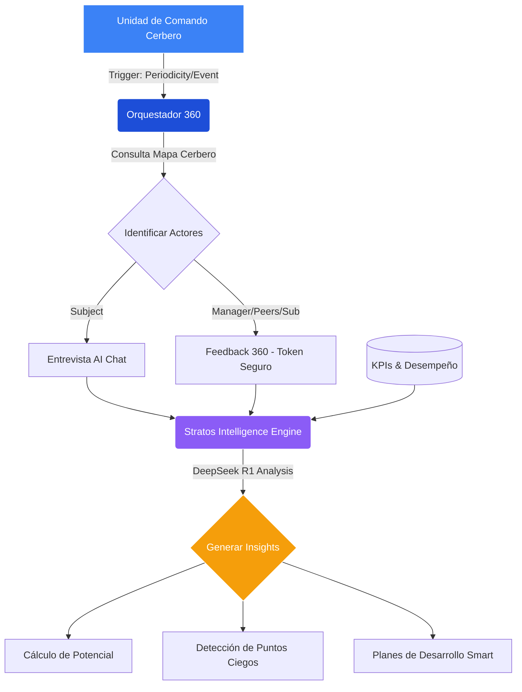

# Especificación Detallada: Proceso de Evaluación Talento 360

Este documento describe con precisión técnica y funcional el flujo completo del módulo Talento 360 en Stratos, desde la orquestación inicial hasta la generación de insights por IA.

## 0. Diagrama de Flujo del Proceso

---

## 1. Fase de Configuración y Disparo (Orquestación)

### 1.1 Identificación de Actores

El sistema utiliza la estructura orgánica definida en la tabla `people` para identificar los roles en la evaluación:

- **Sujeto:** El colaborador evaluado.
- **Evaluadores:** Seleccionados automáticamente mediante relaciones jerárquicas:
    - **Jefe Directo:** Identificado por la relación de gestión en la plataforma.
    - **Pares (Peers):** Colaboradores en el mismo departamento con nivel de cargo similar.
    - **Subordinados:** Reportes directos del sujeto.

### 1.2 Inicio del Proceso

Se dispara a través de `AssessmentController@startSession`.

1.  Se crea un `AssessmentSession` para el sujeto (Sujeto -> IA).
2.  Se generan `AssessmentRequest` para cada evaluador externo.
3.  **Tokenización:** Cada solicitud externa recibe un `token` único de 40 caracteres para acceso seguro y anónimo (si se configura).

---

## 2. Fase de Recolección de Datos (Ejecución en Vivo)

### 2.1 Entrevista Psicométrica (Sujeto <-> IA)

- **Canal:** Chat en vivo en la interfaz de Stratos.
- **Lógica:** El `StratosAssessmentService` conecta con el motor Python (`/interview/chat`).
- **Dinámica:** La IA no sigue un guion fijo; analiza las respuestas del sujeto en tiempo real y genera preguntas de seguimiento basadas en incidentes críticos para validar rasgos de personalidad y potencial.

### 2.2 Evaluación Externa (Evaluadores -> Sujeto)

- **Canal:** Formulario web accedido vía token.
- **Selección Inteligente de Preguntas:** El sistema utiliza el `SkillQuestionBank` para personalizar el formulario:
    - Filtra preguntas por `skill_id` (basado en el rol actual del sujeto).
    - Filtra por `target_relationship` (ej: una pregunta para el jefe es distinta a la de un subalterno).
- **Metodología BARS (Behaviorally Anchored Rating Scales):** Los evaluadores no solo puntúan del 1 al 5, sino que deben validar comportamientos observables. El sistema permite adjuntar `evidence_url` si se requiere respaldo.

---

## 3. Fase de Procesamiento e Inteligencia (Cruce AI)

Cuando el sujeto finaliza su entrevista y los evaluadores completan sus formularios, el sistema ejecuta el análisis final vía `AssessmentController@analyze`:

1.  **Consolidación Contextual:** Se agrupa la transcripción del chat, las respuestas de los evaluadores y los KPIs históricos del sujeto.
2.  **Lógica del Orquestador 360 (Python):**
    - **Detección de Sesgos:** Identifica si un evaluador está siendo excesivamente riguroso o lenitivo.
    - **Análisis de Puntos Ciegos:** Cruza la "Auto-imagen" (Entrevista) vs la "Imagen Pública" (Feedback 360).
    - **Cálculo de Potencial:** Algoritmos de DeepSeek R1 ponderan las fuentes para emitir un `overall_potential` score.

---

## 4. Fase de Resultados y Acciones

### 4.1 Informe de Inteligencia Estratégica (Explicabilidad IA)

El reporte final no es solo una tabla de puntajes; es un informe narrativo auditable:

- **AI Reasoning Flow:** Visualización de los pasos lógicos seguidos por el agente (ej: "Contrastando auto-percepción con feedback de subordinados").
- **Evidence-Based Rationale:** Cada rasgo diagnosticado incluye una justificación basada en evidencia textual extraída de las fuentes.
- **Detección de "Blind Spots":** Identificación automática de brechas entre la auto-percepción y la percepción del entorno.
- **Gráfico de Arquitectura Cognitiva:** Visualización tipo radar para entender el balance de competencias del sujeto.

### 4.2 Cierre del Ciclo (Feedback Loop)

Los resultados alimentan automáticamente:

1.  **Smart Paths:** Creación de rutas de aprendizaje específicas para cerrar los gaps detectados.
2.  **Bitácora de Mentoría:** Sugerencia de mentores internos que dominen las áreas donde el sujeto tiene "puntos ciegos".

---

## 5. Guía para Pruebas (Testing)

Para validar este proceso, se deben realizar las siguientes pruebas:

1.  **Prueba de Roles:** Verificar que el JEFE reciba preguntas distintas a las del PAR para el mismo sujeto.
2.  **Prueba de Continuidad:** Iniciar una entrevista, cerrarla y verificar que la IA retome el contexto exacto al volver.
3.  **Prueba de Análisis:** Completar un feedback externo con valores opuestos a la entrevista del sujeto y validar que la IA detecte el "Punto Ciego" en el reporte final.

---

**Documento de Referencia Técnica**  
**Versión:** 1.0  
**Proyecto:** Stratos Talent Intelligence
