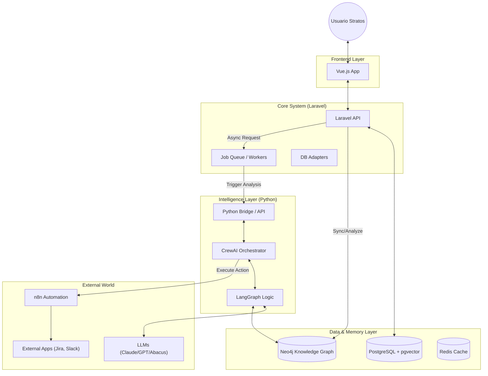

# Documento Maestro: Arquitectura Inteligente y Roadmap de Stratos

**Versión:** 1.0 (Borrador Inicial)  
**Fecha:** 17 de Febrero, 2026  
**Objetivo:** Formalizar el Stack Tecnológico, la Visión Arquitectónica y la Hoja de Ruta para la evolución de Stratos desde una aplicación transaccional a una Plataforma de Inteligencia Organizacional.

---

## 1. Visión: De la Gestión a la "Conciencia Organizacional"

Stratos no es solo un sistema para registrar roles y competencias; es un **Sistema Operativo para el Talento**. Su misión es entender profundamente la estructura de la organización, predecir sus necesidades futuras y orquestar las estrategias para cerrar esas brechas de manera autónoma e inteligente.

Para lograr esto, evolucionamos de una arquitectura monolítica tradicional a una **Arquitectura Híbrida Cognitiva**, donde la robustez transaccional de PHP se une a la flexibilidad de razonamiento de Python/IA.

---

## Documentación Relacionada

- **Modelo Conceptual:** [Referencia del Modelo de Competencias (Iceberg Dinámico)](./COMPETENCY_MODEL_REFERENCE.md) - _Fundamento teórico-científico de cómo Stratos entiende y evalúa el talento._
- **Orquestación de Agentes:** [Guía de Agentes IA (La Fuerza Digital)](./AGENT_ORCHESTRATION_GUIDE.md) - _Documentación detallada de los objetivos, personas y modelos de IA de cada agente especializado._

---

## 2. El Stack Tecnológico: Nuestra Brújula

Hemos seleccionado cada componente no por moda, sino por su capacidad específica para resolver un problema crítico en nuestra visión.

### A. El Núcleo (The Core)

- **Laravel (PHP 8.x) + Vue.js (Frontend):**
    - **Rol:** El Sistema Nervioso Central.
    - **Objetivo:** Manejar la autenticación, permisos, reglas de negocio "duras", APIs REST y la experiencia de usuario reactiva. Es la fuente de la verdad transaccional.
    - **Justificación:** Estabilidad, velocidad de desarrollo y robustez empresarial comprobada.

### B. El Córtex Cerebral (The Brain)

- **Python (FastAPI / Scripts):**
    - **Rol:** El puente de Inteligencia.
    - **Objetivo:** Ejecutar lógica difusa, modelos de lenguaje (LLMs) y procesamiento de datos complejos que PHP no maneja nativamente.
    - **Patrón:** Microservicios o Scripts bajo demanda (`Process` en Laravel) que reciben contexto y devuelven estrategias.

### C. La Memoria (The Memory)

- **PostgreSQL + pgvector:**
    - **Rol:** Memoria Estructurada y Semántica.
    - **Objetivo:** Almacenar datos relacionales (usuarios, roles) Y vectores (embeddings de competencias).
    - **Razón:** Evita la complejidad de mantener una base de datos vectorial separada (como Pinecone), permitiendo consultas híbridas ("Dame candidatos expertos en React [Vector] que vivan en SCL [Relacional]").

- **Neo4j:**
    - **Rol:** Memoria Asociativa (El Grafo de Conocimiento).
    - **Objetivo:** Modelar la "Conciencia". Entender relaciones complejas: _impacto de una habilidad obsoleta, rutas de aprendizaje óptimas, influencia informal_.
    - **Razón:** Las bases relacionales sufren con las consultas de "n-grados de separación". Los grafos brillan aquí.

### D. La Fuerza de Trabajo (The Workforce)

- **CrewAI:**
    - **Rol:** Orquestación de Roles.
    - **Objetivo:** Definir _quién_ hace el trabajo. Agentes especializados (Investigador, Estratega, Reclutador) que colaboran para resolver un problema complejo (ej: "Diseñar un plan de contratación").
    - **Razón:** Estructura el caos de los LLMs asignando responsabilidades claras.

- **LangGraph:**
    - **Rol:** Control de Flujo Cognitivo.
    - **Objetivo:** Definir _cómo_ piensan los agentes. Permite ciclos de reflexión, memoria a largo plazo y "human-in-the-loop" (pedir aprobación antes de actuar).

### E. La Integración (The Hands)

- **n8n:**
    - **Rol:** Automatización de Última Milla.
    - **Objetivo:** Conectar Stratos con el mundo real (Slack, Jira, LinkedIn, ATS).
    - **Razón:** Evita programar cientos de integraciones API a mano. Si los agentes deciden "Contratar", n8n ejecuta la acción.

### F. Los Modelos (The Intelligence)

- **Abacus.AI:** Para predicción numérica y forecasting (Escenarios Cuantitativos).
- **Claude 3.5 Sonnet / GPT-5:** Para razonamiento complejo, codificación y empatía (Agentes Cualitativos).

---

## 3. Diagrama de Arquitectura Conceptual

---

## 4. Roadmap de Evolución: La Rueda de la Fortuna

Nuestra implementación seguirá fases iterativas, asegurando valor en cada paso.

### **Fase 1: Fundamentos Sólidos (Estado Actual 📍)**

- [x] CRUD de Roles y Competencias (MySQL/Postgres).  
    _Completado antes de 2026-02-17_
- [x] Diseño de Escenarios y Talento Base.  
    _Completado antes de 2026-02-17_
- [x] Cálculo de Brechas (Gaps) simple en PHP.  
    _Completado antes de 2026-02-17_
- [x] Migración completa a PostgreSQL + pgvector.  
    _Completado al 100% (2026-02-19)_

### **Fase 2: El Puente de Agentes (Siguiente Paso Inmediato 🚀)**

- **Objetivo:** Que el sistema "piense" sobre los datos existentes.
- [x] Crear microservicio/script Python básico.  
    _Completado (python_services/app/main.py, 2026-02-18)_
- [x] Definir el contrato JSON (Input: Brecha detectada -> Output: Estrategia sugerida).  
    _Completado (2026-02-18)_
- [~] Implementar el primer Agente Simple (CrewAI): "El Analista de Brechas".  
    _PoC funcional en main.py, falta prompt final y despliegue productivo (2026-02-19)_

### **Fase 3: Inteligencia Estratégica & Automatización**

- **Objetivo:** Cerrar el ciclo con acción.
- [ ] Integrar n8n para notificar sugerencias.  
    _Pendiente (2026-02-19)_
- [ ] Refinar Agentes con LangGraph para flujos más complejos.  
    _Pendiente (2026-02-19)_
- [ ] Frontend: Mostrar el "Razonamiento" del agente en la UI de Vue.  
    _Pendiente (2026-02-19)_

### **Fase 4: La "Conciencia" (Knowledge Graph)**

- **Objetivo:** Entender el impacto sistémico.
- [x] Levantar instancia de Neo4j.  
    _Completado (2026-02-17)_
- [x] Script de sincronización (ETL): Postgres -> Neo4j.  
    _Completado (python_services/neo4j_etl.py, 2026-02-18)_
- [x] Primera funcionalidad de Grafo: "Análisis de Impacto de Retiro".  
    _Completado (2026-02-18)_

### **Fase 5: Módulos Avanzados (El "Futuro")**

- **Objetivo:** Expansión horizontal de la inteligencia.
- [ ] Chatbot Entrevistador (BEI).  
    _Pendiente (2026-02-19)_
- [ ] Psicometría Cognitiva & Inferencial.  
    _Pendiente (2026-02-19)_
- [ ] Evaluación 360° Viva.  
    _Pendiente (2026-02-19)_
- [ ] People Experience (PX) & Engagement.  
    _Pendiente (2026-02-19)_
- [ ] E-Learning & LMS Integration.  
    _Pendiente (2026-02-19)_

----

## 5. Próximos Pasos (TODO List - Sesiones Inmediatas)

### Para la Sesión de "Introducción de Agentes":

1.  [x] Infraestructura Python: entorno virtual y scripts base en `/python_services/`.  
        _Completado (2026-02-18)_
2.  [x] Contrato de Datos: definir campos enviados al agente.  
        _Completado (2026-02-18)_
3.  [~] Primer Prompt: diseñar el prompt del "Talent Strategy Agent" para CrewAI.  
        _En progreso, falta prompt final (2026-02-19)_
4.  [x] Integración Laravel: Job `AnalyzeTalentGap` que dispara proceso Python.  
        _Completado (2026-02-18)_

----

_Este documento es vivo. Se actualizará conforme aprendamos y evolucionemos el sistema._
