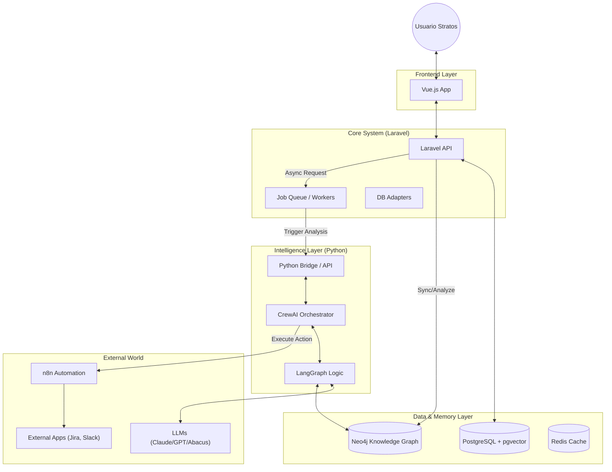

# Documento Maestro: Arquitectura Inteligente y Roadmap de Stratos

**Versión:** 1.0 (Borrador Inicial)  
**Fecha:** 17 de Febrero, 2026  
**Objetivo:** Formalizar el Stack Tecnológico, la Visión Arquitectónica y la Hoja de Ruta para la evolución de Stratos desde una aplicación transaccional a una Plataforma de Inteligencia Organizacional.

---

## 1. Visión: De la Gestión a la "Conciencia Organizacional"

Stratos no es solo un sistema para registrar roles y competencias; es un **Sistema Operativo para el Talento**. Su misión es entender profundamente la estructura de la organización, predecir sus necesidades futuras y orquestar las estrategias para cerrar esas brechas de manera autónoma e inteligente.

Para lograr esto, evolucionamos de una arquitectura monolítica tradicional a una **Arquitectura Híbrida Cognitiva**, donde la robustez transaccional de PHP se une a la flexibilidad de razonamiento de Python/IA.

---

## Documentación Relacionada

- **Modelo Conceptual:** [Referencia del Modelo de Competencias (Iceberg Dinámico)](./COMPETENCY_MODEL_REFERENCE.md) - _Fundamento teórico-científico de cómo Stratos entiende y evalúa el talento._

---

## 2. El Stack Tecnológico: Nuestra Brújula

Hemos seleccionado cada componente no por moda, sino por su capacidad específica para resolver un problema crítico en nuestra visión.

### A. El Núcleo (The Core)

- **Laravel (PHP 8.x) + Vue.js (Frontend):**
    - **Rol:** El Sistema Nervioso Central.
    - **Objetivo:** Manejar la autenticación, permisos, reglas de negocio "duras", APIs REST y la experiencia de usuario reactiva. Es la fuente de la verdad transaccional.
    - **Justificación:** Estabilidad, velocidad de desarrollo y robustez empresarial comprobada.

### B. El Córtex Cerebral (The Brain)

- **Python (FastAPI / Scripts):**
    - **Rol:** El puente de Inteligencia.
    - **Objetivo:** Ejecutar lógica difusa, modelos de lenguaje (LLMs) y procesamiento de datos complejos que PHP no maneja nativamente.
    - **Patrón:** Microservicios o Scripts bajo demanda (`Process` en Laravel) que reciben contexto y devuelven estrategias.

### C. La Memoria (The Memory)

- **PostgreSQL + pgvector:**
    - **Rol:** Memoria Estructurada y Semántica.
    - **Objetivo:** Almacenar datos relacionales (usuarios, roles) Y vectores (embeddings de competencias).
    - **Razón:** Evita la complejidad de mantener una base de datos vectorial separada (como Pinecone), permitiendo consultas híbridas ("Dame candidatos expertos en React [Vector] que vivan en SCL [Relacional]").

- **Neo4j:**
    - **Rol:** Memoria Asociativa (El Grafo de Conocimiento).
    - **Objetivo:** Modelar la "Conciencia". Entender relaciones complejas: _impacto de una habilidad obsoleta, rutas de aprendizaje óptimas, influencia informal_.
    - **Razón:** Las bases relacionales sufren con las consultas de "n-grados de separación". Los grafos brillan aquí.

### D. La Fuerza de Trabajo (The Workforce)

- **CrewAI:**
    - **Rol:** Orquestación de Roles.
    - **Objetivo:** Definir _quién_ hace el trabajo. Agentes especializados (Investigador, Estratega, Reclutador) que colaboran para resolver un problema complejo (ej: "Diseñar un plan de contratación").
    - **Razón:** Estructura el caos de los LLMs asignando responsabilidades claras.

- **LangGraph:**
    - **Rol:** Control de Flujo Cognitivo.
    - **Objetivo:** Definir _cómo_ piensan los agentes. Permite ciclos de reflexión, memoria a largo plazo y "human-in-the-loop" (pedir aprobación antes de actuar).

### E. La Integración (The Hands)

- **n8n:**
    - **Rol:** Automatización de Última Milla.
    - **Objetivo:** Conectar Stratos con el mundo real (Slack, Jira, LinkedIn, ATS).
    - **Razón:** Evita programar cientos de integraciones API a mano. Si los agentes deciden "Contratar", n8n ejecuta la acción.

### F. Los Modelos (The Intelligence)

- **Abacus.AI:** Para predicción numérica y forecasting (Escenarios Cuantitativos).
- **Claude 3.5 Sonnet / GPT-5:** Para razonamiento complejo, codificación y empatía (Agentes Cualitativos).

---

## 3. Diagrama de Arquitectura Conceptual

---

## 4. Roadmap de Evolución: La Rueda de la Fortuna

Nuestra implementación seguirá fases iterativas, asegurando valor en cada paso.

### **Fase 1: Fundamentos Sólidos (Estado Actual 📍)**

- [x] CRUD de Roles y Competencias (MySQL/Postgres).
- [x] Diseño de Escenarios y Talento Base.
- [x] Cálculo de Brechas (Gaps) simple en PHP.
- [ ] Migración completa a PostgreSQL + pgvector (si aún no se ha hecho).

### **Fase 2: El Puente de Agentes (Siguiente Paso Inmediato 🚀)**

- **Objetivo:** Que el sistema "piense" sobre los datos existentes.
- [ ] Crear microservicio/script Python básico.
- [ ] Definir el contrato JSON (Input: Brecha detectada -> Output: Estrategia sugerida).
- [ ] Implementar el primer Agente Simple (CrewAI): "El Analista de Brechas".
    - _Tarea:_ Leer un Gap de competencia y sugerir si es mejor "Comprar" (Contratar) o "Construir" (Capacitar) basado en reglas simples y consulta a LLM.

### **Fase 3: Inteligencia Estratégica & Automatización**

- **Objetivo:** Cerrar el ciclo con acción.
- [ ] Integrar n8n para notificar sugerencias.
- [ ] Refinar Agentes con LangGraph para flujos más complejos (ej: "Investigar salario de mercado" antes de sugerir contratación).
- [ ] Frontend: Mostrar el "Razonamiento" del agente en la UI de Vue (no solo el resultado, sino el _porqué_).

### **Fase 4: La "Conciencia" (Knowledge Graph)**

- **Objetivo:** Entender el impacto sistémico.
- [ ] Levantar instancia de Neo4j.
- [ ] Script de sincronización (ETL): Postgres -> Neo4j.
- [ ] Primera funcionalidad de Grafo: "Análisis de Impacto de Retiro" (Si Juan se va, ¿qué competencias críticas perdemos y quién más las tiene?).

### **Fase 5: Módulos Avanzados (El "Futuro")**

- **Objetivo:** Expansión horizontal de la inteligencia.
- [ ] **Chatbot Entrevistador:** Agente que realiza Entrevistas de Incidentes Críticos (BEI) para extraer evidencias conductuales reales, no hipotéticas.
- [ ] **Psicometría Cognitiva & Inferencial:**
    - Uso de agentes para inferir rasgos de personalidad (Big Five/DISC) a partir de patrones de lenguaje y código (GitHub/Comunicaciones), reduciendo la necesidad de tests invasivos.
    - Validación cruzada de "Evidencias de Resultados" contra el Grafo de Conocimiento (¿Realmente ese proyecto tuvo el impacto que el candidato dice?).
- [ ] **Evaluación 360° Viva:** Análisis de contribución basado en grafos de interacción y reputación técnica, no jerarquía.
- [ ] **Termómetro Organizacional:** Análisis de sentimiento en tiempo real.

---

## 5. Próximos Pasos (TODO List - Sesiones Inmediatas)

### Para la Sesión de "Introducción de Agentes":

1.  [ ] **Infraestructura Python:** Preparar el entorno virtual y scripts base en `/python_services/`.
2.  [ ] **Contrato de Datos:** Definir exactamente qué campos del `Step 2` (Gaps detectados) se enviarán al agente.
3.  [ ] **Primer Prompt:** Diseñar el prompt del "Talent Strategy Agent" para CrewAI.
4.  [ ] **Integración Laravel:** Crear el Job `AnalyzeTalentGap` que dispare el proceso de Python.

---

_Este documento es vivo. Se actualizará conforme aprendamos y evolucionemos el sistema._
