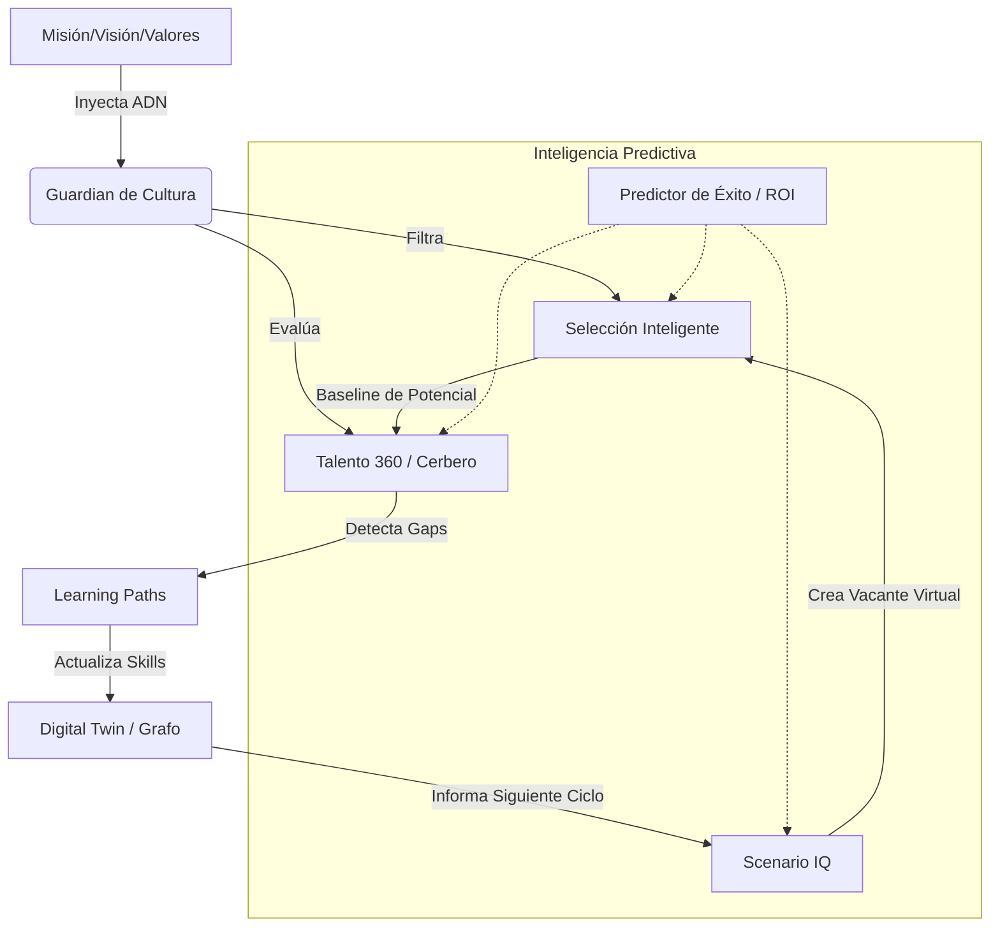

# 🧶 Mapa de Integración Circular: La Ingeniería de Talento Sin Cabos Sueltos

Este documento audita y garantiza que los módulos de Stratos (360, Escenarios, Selección y Experiencia) funcionan como un único organismo vivo, eliminando silos de información.

---

## 1. El Flujo de Datos Maestro (The Loop)

---

## 2. Auditoría de "Cabos Sueltos" (Garantía de Integración)

| Posible Cabo Suelto                         | Solución Stratos (Garantía)                                                                                                                            |
| :------------------------------------------ | :----------------------------------------------------------------------------------------------------------------------------------------------------- |
| **¿Cómo sabe Reclutamiento qué contratar?** | **Integración E-S:** Scenario IQ exporta el "Perfil de Resonancia" al Agente Matchmaker. El candidato ve su alineación en el **Portal de Candidatos**. |
| **¿Incertidumbre del candidato?**           | **Integración Portal:** El candidato interactúa con el **Matchmaker de Resonancia** para resolver dudas tácticas sobre el blueprint del rol.           |
| **¿Cómo se garantiza la ética de la IA?**   | **Integración Sentinel:** Cada decisión agéntica es auditada por **Stratos Sentinel**, creando una explicación humana del razonamiento de la IA.       |
| **¿El Org Chart está desactualizado?**      | **Integración L-G:** Cada vez que un Learning Path se completa, el Grafo (Neo4j) se actualiza, informando instantáneamente al **Simulador Orgánico**.  |

---

## 3. Puntos de Control de la IA (Audit Trail & Integrity)

Para asegurar la transparencia y la "Ventaja Injusta", cada transición genera un trace auditado por el **Sentinel**:

1.  **Trace-Selection:** "Candidato X seleccionado por Resonancia ADN de 0.95. Portal habilitado para feedback del aplicante."
2.  **Trace-Ethics:** "Validación de Sentinel: No se detectan sesgos de género o edad en la recomendación de promoción del nodo de Ingeniería."
3.  **Trace-Scenario:** "Simulador Orgánico proyecta ROI positivo en 6 meses tras el re-skilling del 20% de la fuerza laboral seleccionada."

---

## 4. Conclusión de la Auditoría

No existen cabos sueltos porque Stratos utiliza una **Única Fuente de Verdad Semántica**. No importa en qué módulo estés, el sistema siempre sabe quién es la persona, qué valores representa y cuál es su techo de crecimiento.

**Stratos es un ecosistema cerrado, inteligente y auto-optimizado.**
_© 2026 Stratos Intelligence Architecture Group_
