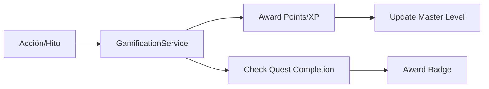

# 🎮 Ecosistema de Gamificación y Misiones de Gremio (Talent Journey)

**Status:** ✅ Implementado (Bloque D4/D5)  
**Fecha:** 8 de Marzo de 2026  
**Versión:** 1.1  
**Responsable:** Stratos Architecture Group

---

## 📋 1. Visión y Propósito

El sistema de Gamificación en Stratos no es un simple programa de recompensas ("Pointsification"). Es un **motor de engagement estratégico** diseñado para:

1.  **Visibilizar el progreso:** Transformar el desarrollo de habilidades en una trayectoria tangible (Niveles de Maestría).
2.  **Fomentar la colaboración:** Las "Misiones de Gremio" impulsan el trabajo en equipo para cerrar brechas colectivas.
3.  **Reforzar la cultura:** Premiar comportamientos alineados con el Manifiesto de la organización mediante Badges (Insignias).

---

## 🏗️ 2. Arquitectura de Datos

### 🧩 Modelos Principales

- **`Quest` (Misión):** Define el desafío (individual o grupal), la descripción, los requisitos y la recompensa.
- **`Badge` (Insignia):** Representación visual de un logro alcanzado o una maestría en un dominio.
- **`PersonQuest`:** Pivot que registra el progreso de una persona en una misión específica (`active`, `completed`, `failed`).
- **`PeoplePoints`:** Registro histórico de XP (Experiencia) ganada por el colaborador.

### 🔄 Flujo de Recompensas

---

## 🎯 3. Tipos de Misiones (Quests)

### Individuales (Deep Work)

- **Skill Mastery:** Completar una ruta de aprendizaje en el LMS.
- **Knowledge Transfer:** Mentorizar a 3 colaboradores nuevos.
- **Innovation:** Documentar y ejecutar una iniciativa de ahorro o eficiencia.

### Misiones de Gremio (Collective Quests)

- **Shadowing:** Que un equipo de Ingeniería pase una semana con el equipo de Ventas para entender al cliente.
- **Gap Closing:** Que el departamento logre un promedio de nivel 4 en una skill crítica para el **Scenario IQ** del próximo semestre.

---

## 🛠️ 4. Servicios y Controladores

### `GamificationService.php`

- `awardPoints`: Otorga XP con persistencia y log de auditoría.
- `startQuest` / `completeQuest`: Gestiona el ciclo de vida de los desafíos.
- `getPersonQuests`: Recupera el estado actual del "Hero's Journey" del colaborador.

### `GamificationController.php`

- `GET /api/gamification/my-quests`: Lista para el portal Mi Stratos.
- `POST /api/gamification/quests/{id}/start`: Activa un nuevo reto.
- `POST /api/gamification/quests/{id}/progress`: Actualiza el avance manual o automático.

---

## 📈 5. Niveles de Maestría (Mastery Circles)

En lugar de cargos tradicionales, Stratos permite visualizar el **Círculo de Influencia**:

1.  **Aprendiz:** Posee conocimientos teóricos (Nivel 1-2).
2.  **Practicante:** Ejecuta con autonomía (Nivel 3).
3.  **Mentor:** Capaz de guiar a otros (Nivel 4).
4.  **Arquitecto/Sabio:** Define el estándar de la skill en la organización (Nivel 5).

---

## 🚀 6. Próximos Pasos: El Marketplace Activo (D3)

El sistema de gamificación se integrará con el **Marketplace de Talento** para que participar en proyectos críticos de la empresa otorgue XP bonificado, creando un círculo virtuoso de crecimiento y necesidad de negocio.

---

> _"No solo medimos lo que la gente hace, celebramos quiénes se están convirtiendo."_
