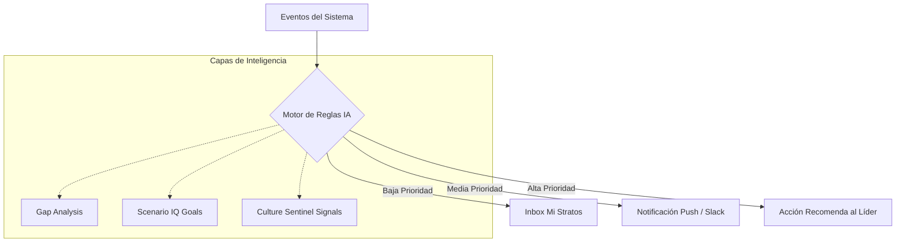

# 🧠 Nudging Proactivo: El Catalizador de la Ejecución en Stratos

**Status:** 💠 Concepto Arquitectónico Central  
**Fecha:** 8 de Marzo de 2026  
**Versión:** 1.0  
**Bloque:** D2 (LMS & Mentor Hub) / D4 (Gamificación)

---

## 📋 1. ¿Qué es el Nudging Proactivo?

El **Nudging Proactivo** es la capacidad de Stratos para actuar como un "asistente inteligente" que impulsa el comportamiento humano hacia los objetivos estratégicos de la organización, de manera sutil pero efectiva.

Basado en la **Teoría del Nudge** (Premio Nobel Richard Thaler), se aleja de la gestión por mandato o prohibición para enfocarse en **facilitar la decisión correcta** en el momento adecuado. En Stratos, esto significa transformar la plataforma de un repositorio de datos pasivo a un **agente activo que cierra brechas de talento**.

---

## 🏗️ 2. Arquitectura del Sistema de Nudging

El sistema opera bajo un ciclo continuo de **Detección → Contextualización → Ejecución**:

### Componentes Clave:

1.  **SmartAlertService**: El detector de anomalías o hitos (ej. una brecha de skill detectada en un High Potential).
2.  **Orquestador de Mensajería**: Selecciona el canal menos intrusivo pero más efectivo (Slack, Teams, Email, In-App).
3.  **Contexto Estratégico**: Asegura que cada "codazo" esté alineado con un Escenario de Negocio activo.

---

## 🎯 3. Dominios de Aplicación

### A. Desarrollo y Aprendizaje (LMS / Reskilling)

- **El Problema:** Los catálogos de cursos suelen ser ignorados.
- **El Nudge:** _"Llevas un 70% de tu ruta de AI Architect. Solo te falta una sesión de 15 min. ¿Quieres que te reservemos tiempo mañana a las 9:00 AM para terminarla?"_

### B. Hub de Mentoría y Redes Sociales

- **El Problema:** La mentoría pierde impulso tras las primeras reuniones.
- **El Nudge:** _"No has interactuado con tu mentee en 10 días. Aquí tienes 3 temas clave basados en sus brechas actuales que podrías tratar en su próxima charla."_

### C. Retención y Sentinel de Cultura

- **El Problema:** El attrition (rotación) suele detectarse cuando ya es tarde.
- **El Nudge (Hacia el Líder):** _"Detectamos una caída en el engagement de Roberto (Nodo Crítico en el Escenario Q3). Te sugerimos un check-in informal esta semana para hablar sobre su visión de futuro."_

### D. Gamificación y Micro-Misiones (Quests)

- **El Problema:** Las misiones pueden parecer tareas extras.
- **El Nudge:** _"Tu equipo está a solo 50 puntos de desbloquear el badge de 'Expertos en Python'. Haz un code review hoy y completa el objetivo."_

---

## 📈 4. Beneficios Estratégicos

1.  **Reducción del "Time-to-Execution"**: Las brechas se cierran más rápido porque el sistema empuja al usuario a la acción.
2.  **Productividad Consciente**: Evita el agobio de tareas masivas mediante micro-pasos sugeridos.
3.  **Alineación en Tiempo Real**: El comportamiento diario de la plantilla se ajusta dinámicamente a los cambios en el **Scenario IQ**.

---

## 🛠️ 5. Próximos Pasos Técnicos (Implementación)

1.  **Reglas de Nudging**: Definir disparadores (Triggers) vinculados a la tabla `notifications` y `smart_alerts`.
2.  **Integración con Calendario**: Conectar con servicios de agenda para reservar slots de aprendizaje sugeridos.
3.  **Feedback Loop**: Medir la tasa de conversión de los nudges (¿El usuario hizo clic? ¿Completó la acción?) para que la IA aprenda qué tonos y canales funcionan mejor para cada colaborador.

---

> _"Stratos no solo te dice que hay un iceberg adelante; te sugiere el ángulo exacto para virar el timón y el momento justo para hacerlo."_
