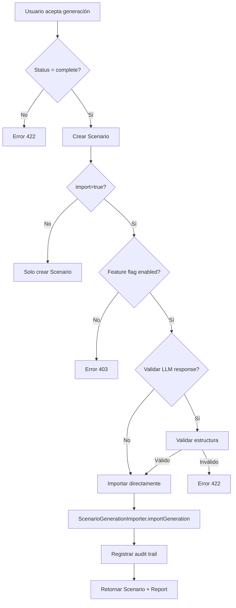
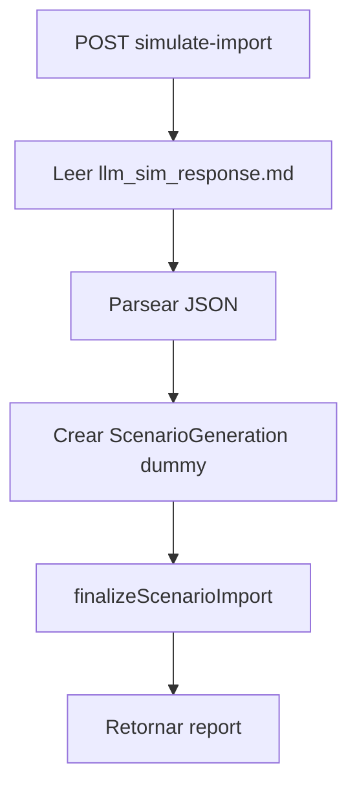

# 🔄 Flujo de Importación de Datos LLM en Stratos

## Resumen Ejecutivo

La importación de datos generados por el LLM se dispara en **dos escenarios principales**:

1. **Endpoint de Aceptación** (`POST /api/strategic-planning/scenarios/generate/{id}/accept`) - **Producción**
2. **Endpoint de Simulación** (`POST /api/strategic-planning/scenarios/simulate-import`) - **Testing**

---

## 1️⃣ Flujo de Producción: `accept()`

### Trigger

El usuario **acepta** una generación LLM completada desde el frontend.

### Endpoint

```
POST /api/strategic-planning/scenarios/generate/{id}/accept
```

### Parámetros

```json
{
    "import": true // ⚠️ CRÍTICO: Debe ser true para disparar la importación
}
```

### Flujo Detallado



### Código Relevante

**Controlador**: `app/Http/Controllers/Api/ScenarioGenerationController.php`

```php
public function accept(Request $request, $id)
{
    // 1. Validar generación completa
    $generation = ScenarioGeneration::find($id);

    // 2. Crear Scenario
    $scenario = \App\Models\Scenario::create($data);

    // 3. ⚠️ IMPORTACIÓN CONDICIONAL
    if ($request->boolean('import', false)) {
        // Feature flag check
        if (!config('features.import_generation')) {
            return response()->json(['success' => false], 403);
        }

        // Validación opcional
        if (config('features.validate_llm_response')) {
            $validator->validate($llm);
        }

        // 🚀 IMPORTACIÓN
        $importer = app(\App\Services\ScenarioGenerationImporter::class);
        $report = $importer->importGeneration($scenario, $generation);
    }

    return response()->json(['success' => true, 'data' => $scenario]);
}
```

### Feature Flags Requeridos

**Archivo**: `config/features.php`

```php
return [
    'import_generation' => env('FEATURE_IMPORT_GENERATION', true),
    'validate_llm_response' => env('FEATURE_VALIDATE_LLM_RESPONSE', false),
];
```

### Audit Trail

Cada intento de importación se registra en `scenario_generations.metadata`:

```json
{
    "import_audit": [
        {
            "attempted_by": 1,
            "attempted_at": "2026-02-15 01:44:35",
            "import": true,
            "result": "success",
            "report": {
                "capabilities": 3,
                "competencies": 9,
                "skills": 27
            }
        }
    ]
}
```

---

## 2️⃣ Flujo de Testing: `simulateImport()`

### Trigger

Endpoint de prueba para validar la importación sin LLM real.

### Endpoint

```
POST /api/strategic-planning/scenarios/simulate-import
```

### Flujo



### Código

```php
public function simulateImport(Request $request, ScenarioGenerationService $svc)
{
    // 1. Cargar JSON simulado
    $filePath = base_path('resources/prompt_instructions/llm_sim_response.md');
    $content = file_get_contents($filePath);

    // 2. Crear generación dummy
    $generation = ScenarioGeneration::create([
        'organization_id' => $orgId,
        'created_by' => $user->id,
        'status' => 'complete',
        'llm_response' => $json,
        'metadata' => ['simulated' => true],
    ]);

    // 3. 🚀 IMPORTACIÓN DIRECTA
    $report = $svc->finalizeScenarioImport($generation);

    return response()->json(['success' => true, 'data' => $report]);
}
```

---

## 3️⃣ Servicio de Importación

### Dos Implementaciones

| Servicio                       | Método                     | Uso                   |
| ------------------------------ | -------------------------- | --------------------- |
| **ScenarioGenerationImporter** | `importGeneration()`       | Producción (legacy)   |
| **ScenarioGenerationService**  | `finalizeScenarioImport()` | **Nuevo** (con roles) |

### ⚠️ IMPORTANTE: Diferencias

#### `ScenarioGenerationImporter::importGeneration()`

- ✅ Importa Capabilities, Competencies, Skills
- ❌ **NO importa Roles**
- ❌ **NO crea Talent Blueprints**
- Usado en `accept()` con `import=true`

#### `ScenarioGenerationService::finalizeScenarioImport()`

- ✅ Importa Capabilities, Competencies, Skills
- ✅ **Importa Roles** con `status = 'in_incubation'`
- ✅ **Crea Talent Blueprints**
- Usado en `simulateImport()`

### 🔧 Recomendación

**Actualizar el método `accept()` para usar `finalizeScenarioImport()`** en lugar de `importGeneration()`:

```php
// ANTES (línea 317)
$importer = app(\App\Services\ScenarioGenerationImporter::class);
$report = $importer->importGeneration($scenario, $generation);

// DESPUÉS (recomendado)
$svc = app(\App\Services\ScenarioGenerationService::class);
$report = $svc->finalizeScenarioImport($generation);
```

---

## 4️⃣ Configuración del Frontend

### Request desde Vue/React

```javascript
// Aceptar generación CON importación
const response = await axios.post(
    `/api/strategic-planning/scenarios/generate/${generationId}/accept`,
    { import: true }, // ⚠️ CRÍTICO
);

// Aceptar generación SIN importación (solo crear Scenario)
const response = await axios.post(
    `/api/strategic-planning/scenarios/generate/${generationId}/accept`,
    { import: false },
);
```

---

## 5️⃣ Verificación Post-Importación

### Query para validar importación

```sql
-- Verificar entidades en incubación
SELECT
  'Capabilities' as entity,
  COUNT(*) as count
FROM capabilities
WHERE status = 'in_incubation'
  AND discovered_in_scenario_id = :scenario_id

UNION ALL

SELECT 'Competencies', COUNT(*)
FROM competencies
WHERE status = 'in_incubation'
  AND discovered_in_scenario_id = :scenario_id

UNION ALL

SELECT 'Skills', COUNT(*)
FROM skills
WHERE status = 'in_incubation'
  AND discovered_in_scenario_id = :scenario_id

UNION ALL

SELECT 'Roles', COUNT(*)
FROM roles
WHERE status = 'in_incubation'
  AND discovered_in_scenario_id = :scenario_id;
```

---

## 6️⃣ Próximos Pasos

### Tareas Pendientes

1. **Unificar servicios de importación**
    - Deprecar `ScenarioGenerationImporter`
    - Migrar `accept()` a usar `finalizeScenarioImport()`

2. **Agregar eventos**

    ```php
    event(new ScenarioImportCompleted($scenario, $report));
    ```

3. **Notificaciones**
    - Notificar al usuario cuando la importación termina
    - Email con resumen de entidades importadas

4. **Dashboard de incubación**
    - Vista para revisar entidades `in_incubation`
    - Workflow de aprobación (pasar de `in_incubation` a `active`)

---

## Resumen

| Aspecto                 | Detalle                                               |
| ----------------------- | ----------------------------------------------------- |
| **Trigger principal**   | `POST /accept` con `import=true`                      |
| **Feature flag**        | `config('features.import_generation')`                |
| **Servicio actual**     | `ScenarioGenerationImporter` (legacy)                 |
| **Servicio nuevo**      | `ScenarioGenerationService::finalizeScenarioImport()` |
| **Testing**             | `POST /simulate-import`                               |
| **Estado de entidades** | `in_incubation`                                       |
| **Audit trail**         | `scenario_generations.metadata.import_audit`          |
