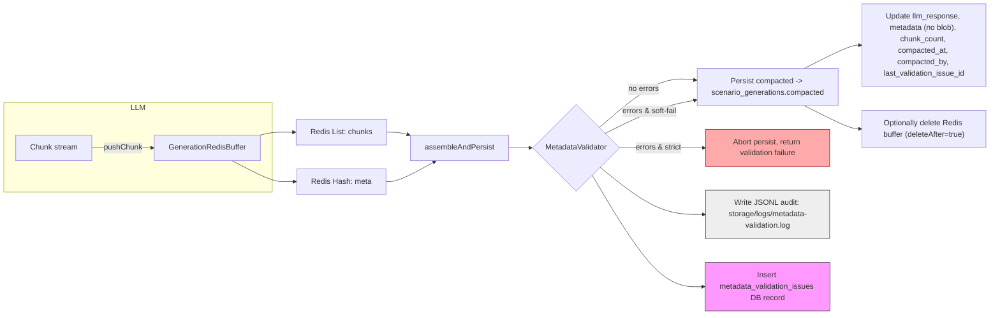

# Flujo de generación: buffer Redis → compactación → persistencia

Resumen conciso del flujo end-to-end para la recepción de chunks desde el LLM (Abacus), buffer en Redis, compactación y persistencia.



Puntos clave

- `pushChunk(...)`: guarda chunks en `Redis::rpush(key)` y actualiza `key:meta` con contadores y timestamps. TTL configurable con `GENERATION_CHUNK_TTL`.
- `assembleAndPersist(...)`: concatena chunks, intenta parse JSON para `llm_response`, base64-encoda y guarda en columna `compacted`.
- Validación ligera: `MetadataValidator::validate()` — si hay errores se escriben en JSONL y en tabla `metadata_validation_issues` y se enlaza el id en `scenario_generations.last_validation_issue_id`.
- Modos:
  - Soft-fail (por defecto): persiste `compacted` y anota `metadata.validation_errors`.
  - Strict: activa con `METADATA_VALIDATION_STRICT=true`, en cuyo caso la persistencia es abortada y se devuelve `ok:false` con `validation_id`.
- Operaciones: hay comandos Artisan para inspección y migración (`debug:emit-validation-test`, `test:redis-buffer`, `compact:generation`, `migrate:compacted-from-metadata`).

Comandos útiles para operaciones locales

```bash
# Aplicar migraciones
php artisan migrate

# Simular validación (escribe JSONL y DB)
php artisan debug:emit-validation-test 9999

# Ensamblar y persistir desde Redis para una generación
php artisan compact:generation {orgId} {generationId} --delete
```

Recomendaciones rápidas

- Mantener `generation_chunks` como respaldo temporal hasta aplicar política de retención; crear job de purge configurable.
- Para blobs grandes, considerar offload a S3 y almacenar sólo URL en `compacted`.
- Comenzar en `soft-fail` en producción; monitorizar `metadata_validation_issues` antes de habilitar `strict`.

---

Archivo generado automáticamente por la tarea de documentación del flujo de generación.

# Buffer de generación (Redis)

Resumen rápido

- Se usa Redis como buffer temporal para almacenar los `chunks` generados por el LLM durante la transmisión.
- El artefacto canónico para la UI/tests es `metadata.compacted` (base64) almacenado en `scenario_generations`.

Key pattern

Clave Redis (recomendada): `app:scenario_planning:org:{organization_id}:scenario:{scenario_id}:generation:{generation_id}:chunks`
Si `scenario_id` no está disponible la key cae a: `app:scenario_planning:org:{organization_id}:generation:{generation_id}:chunks`

TTL

- Se puede configurar mediante la variable de entorno `GENERATION_CHUNK_TTL`.

Operación de ingestión (recomendado)

1. Al recibir un `chunk` del LLM, hacer `RPUSH` en la key anterior.
2. Si la key es nueva, fijar `EXPIRE key GENERATION_CHUNK_TTL`.
3. Mantener LARGO límite y alertas si `LLEN` excede un umbral configurable.

Ensamblado y persistencia

- Worker/command debe:
  - Leer `LRANGE key 0 -1` y concatenar/decodificar los `chunks`.
  - Calcular `chunk_count = LLEN key`.
  - Persistir en BD: `scenario_generations.llm_response` (si aplica), `metadata.compacted` (base64), `metadata.chunk_count` y `metadata.compacted_at`.
  - Opcional: `DEL key` si se desea liberar memoria inmediatamente.

Comando disponible (PoC)

- `php artisan compact:generation {organization_id} {generation_id} {--delete}`
  - Ensambla desde Redis y persiste `metadata.compacted`.
  - `--delete` borra la key Redis tras el guardado.

Buenas prácticas

- Usar Redis solo como buffer temporal; para almacenamiento final usar S3/NDJSON o `metadata.compacted` en BD.
- Para alto volumen, considerar Redis Streams + consumer groups para exactamente-once/ack.
- Comprimir chunks si son grandes y monitorear la memoria de Redis.

Ejemplo de env

```
GENERATION_CHUNK_TTL=86400
```

Comandos Artisan útiles

- `php artisan compact:generation {organization_id} {generation_id} {--delete}`
  - Ensambla los `chunks` desde Redis (según key pattern), calcula `chunk_count`, crea/actualiza `metadata.compacted` en `scenario_generations` y, si se pasa `--delete`, borra la key Redis.
  - Ejemplo:
    ```bash
    php artisan compact:generation 12 59
    php artisan compact:generation 12 59 --delete
    ```

- `php artisan redis:inspect-generation {organization_id} {generation_id} {--scenario_id=} {--delete}`
  - Lista keys Redis que coincidan con el patrón de buffer (muestra `LLEN` para cada key). Si se pasa `--delete` elimina las keys listadas.
  - Ejemplo:
    ```bash
    php artisan redis:inspect-generation 12 59 --scenario_id=345
    php artisan redis:inspect-generation 12 59 --scenario_id=345 --delete
    ```

Notas

- Ambos comandos se descubren automáticamente en Artisan (están bajo `app/Console/Commands`).
- Útiles para QA/operaciones: `inspect` permite auditar y liberar memoria, `compact` persiste el artefacto canónico `metadata.compacted`.
