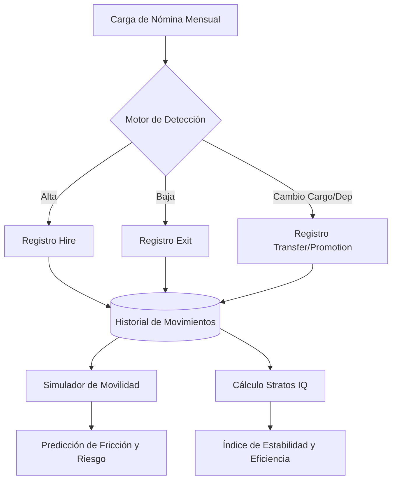

# 🧠 Optimización de Modelos Predictivos y Gemelo Digital

Este documento detalla las mejoras implementadas en el ecosistema de inteligencia de Stratos para elevar la precisión de las simulaciones de movilidad y la medición de la salud organizacional (Stratos IQ).

## 1. Visión General del "Gemelo Digital"

Stratos ha evolucionado para no solo representar la estructura actual, sino para **predecir comportamientos** basados en el historial dinámico. La clave de esta fase es la captura de **Movimientos del Personal (Person Movements)**, que alimenta los motores de simulación con datos reales de trayectoria, rotación y crecimiento.

---

## 2. Refinamiento del Motor de Movilidad (`MobilitySimulationService`)

Hemos optimizado los dos algoritmos críticos que determinan la viabilidad de un movimiento interno:

### A. Cálculo de Fricción Adaptativo
La fricción ya no es solo una medida de "distancia de habilidades". Ahora incorpora el **factor de estabilidad individual**:
- **Penalización por Inestabilidad Reciente**: Si un empleado ha tenido múltiples movimientos en los últimos 6 meses, el sistema incrementa la `friction_score`.
- **Razón**: La "fatiga de cambio" aumenta la probabilidad de fallo en la nueva posición y extiende la curva de aprendizaje.

### B. Evaluación de Riesgo de Legado (Legacy Risk)
Al simular la salida de una persona de un departamento, el sistema ahora evalúa la **Resiliencia Departamental**:
- **Efecto Multiplicador de Vacante**: Si el departamento de origen ha tenido salidas recientes (egresos en los últimos 3 meses), el riesgo de que la nueva salida desestabilice el área aumenta significativamente.
- **Detección de "Fugas de Talento"**: Este modelo permite identificar áreas críticas donde una transferencia interna podría ser más dañina que una contratación externa.

---

## 3. Stratos IQ 2.0: Más allá de las Competencias

El **Stratos IQ** ahora es una métrica holística que combina la capacidad técnica con la salud operativa de la organización.

### Nuevos Índices Integrados:

| Índice | Descripción | Impacto en IQ |
| :--- | :--- | :--- |
| **Stability Index** | Basado en la tasa de egresos de los últimos 90 días. | Mide la retención. Una alta rotación penaliza el IQ global. |
| **Mobility Efficiency** | Ratio entre promociones internas y contrataciones totales. | Premia a las organizaciones que logran cultivar talento propio. |
| **Learning Velocity** | Velocidad de cierre de brechas (Gaps). | Mantiene su peso como motor de crecimiento. |

**Fórmula de Impacto:**
> `IQ = Baseline(100) - (Gap Penalty) + (Learning Velocity Bonus) + (Stability Bonus) + (Mobility Efficiency Bonus)`

---

## 4. Infraestructura de Datos: `PersonMovement`

Para soportar estos modelos, se ha implementado el seguimiento de trayectorias en la base de datos:

- **Entidad `PersonMovement`**: Registra `from_node` y `to_node` (Departamento y Cargo), fecha, tipo de movimiento y el `change_set_id` asociado.
- **Integración con Carga Masiva**: El componente `BulkPeopleImportController` ahora detecta automáticamente estos cambios durante la sincronización mensual y los registra tras la aprobación.

---

## 5. Gobernanza y "Firma Digital" de Baseline

Para asegurar la integridad del Gemelo Digital, hemos implementado un flujo de aprobación riguroso:

1.  **Análisis de Impacto**: Antes de aplicar la carga, el sistema muestra cuántas altas, bajas y traslados se detectaron.
2.  **Firma de Aprobación**: Los cambios deben ser firmados (ej. `APPROVED_BY_HR_LEADER`) para ser persistidos.
3.  **Snapshot de Baseline**: Cada vez que se aprueba una importación masiva, se genera un `OrganizationSnapshot`. Esto permite trackear la evolución del Stratos IQ mes a mes y ver cómo las decisiones de talento afectan la salud de la empresa.

---

> [!TIP]
> **Próximo Paso**: Utilizar el historial de movimientos para entrenar modelos de IA que sugieran el "Próximo Mejor Movimiento" (*Next Best Move*) para empleados de alto potencial, basándose en rutas de éxito históricas.
