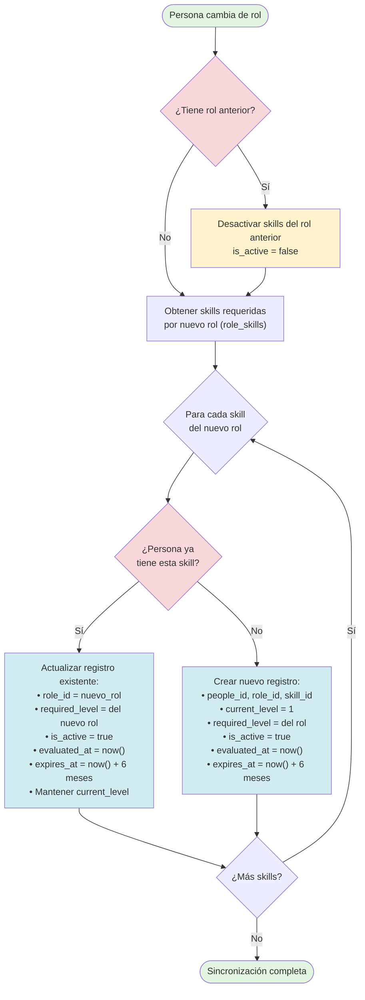
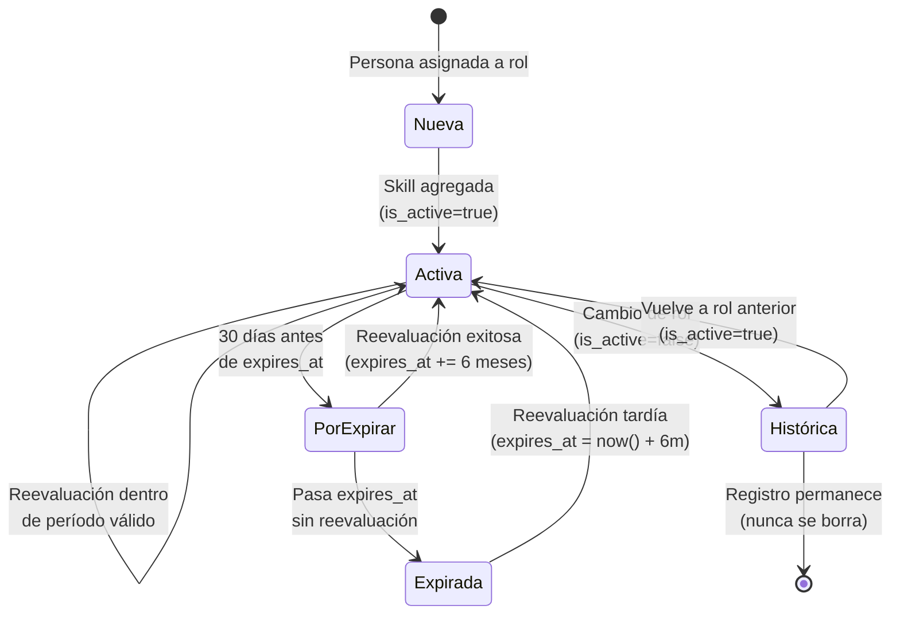
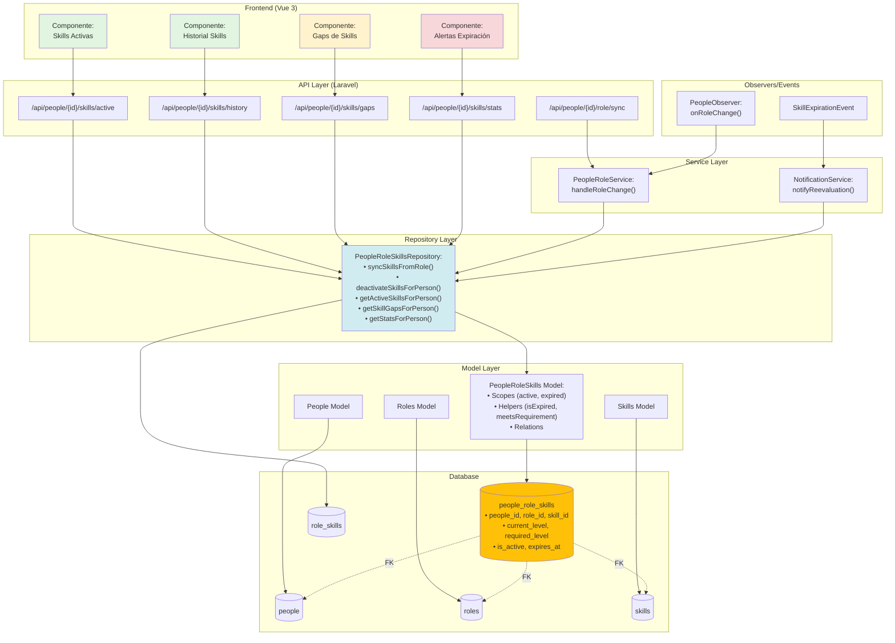
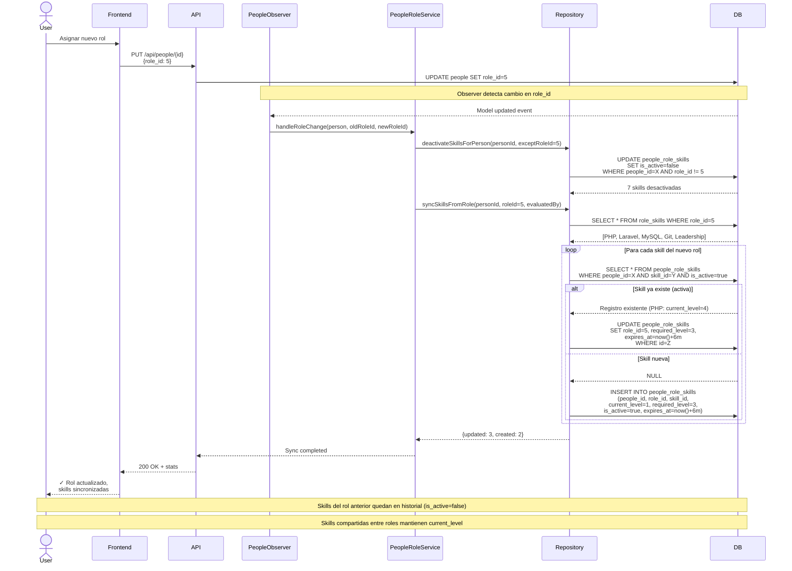
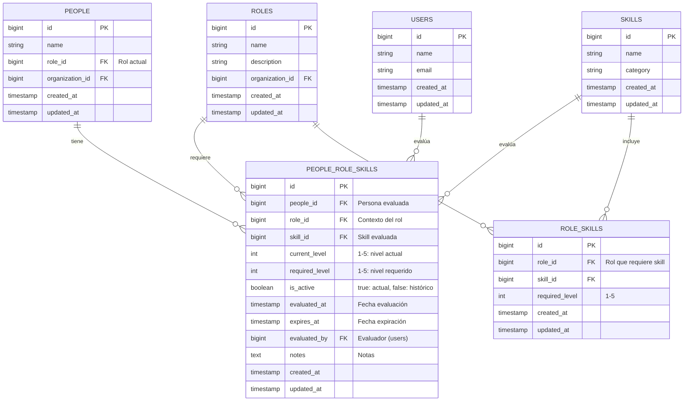

# People Role Skills - Flujo de Operación

## Diagrama de Flujo - Asignación de Rol



---

## Diagrama de Estados - Skill Lifecycle



---

## Diagrama de Componentes - Arquitectura



---

## Diagrama de Secuencia - Cambio de Rol



---

## Diagrama ER - Relaciones



---

## Casos de Uso

### Caso 1: Persona sin skill previa cambia de rol

**Escenario:**
- Juan Pérez es Junior Developer (role_id=1)
- Se le asigna rol Backend Developer (role_id=2)
- Backend Developer requiere: PHP (nivel 3), Laravel (nivel 3), MySQL (nivel 3)
- Juan NO tiene ninguna de esas skills registradas

**Resultado:**
```sql
-- Se crean 3 registros nuevos:
INSERT INTO people_role_skills (people_id, role_id, skill_id, current_level, required_level, is_active, expires_at)
VALUES 
  (123, 2, 10, 1, 3, true, '2026-07-01'),  -- PHP
  (123, 2, 11, 1, 3, true, '2026-07-01'),  -- Laravel
  (123, 2, 12, 1, 3, true, '2026-07-01');  -- MySQL
```

**Gap de skills:** 3 skills (current_level=1 < required_level=3)

---

### Caso 2: Persona con skills previas cambia a rol que comparte algunas

**Escenario:**
- María López es Backend Developer (role_id=2)
- Tiene: PHP (nivel 4), Laravel (nivel 3), MySQL (nivel 4)
- Se le asigna rol Team Lead (role_id=3)
- Team Lead requiere: PHP (nivel 3), Laravel (nivel 2), Leadership (nivel 4), Communication (nivel 4)

**Resultado:**
```sql
-- Step 1: Desactivar skills del rol anterior que NO están en el nuevo
UPDATE people_role_skills 
SET is_active = false 
WHERE people_id = 456 
  AND role_id = 2 
  AND skill_id = 12;  -- MySQL (no requerida en Team Lead)

-- Step 2: Actualizar skills compartidas (PHP, Laravel)
UPDATE people_role_skills 
SET role_id = 3, required_level = 3, is_active = true, expires_at = '2026-07-01'
WHERE people_id = 456 AND skill_id = 10;  -- PHP (mantiene current_level=4)

UPDATE people_role_skills 
SET role_id = 3, required_level = 2, is_active = true, expires_at = '2026-07-01'
WHERE people_id = 456 AND skill_id = 11;  -- Laravel (mantiene current_level=3)

-- Step 3: Crear skills nuevas (Leadership, Communication)
INSERT INTO people_role_skills (people_id, role_id, skill_id, current_level, required_level, is_active, expires_at)
VALUES 
  (456, 3, 20, 1, 4, true, '2026-07-01'),  -- Leadership (nueva)
  (456, 3, 21, 1, 4, true, '2026-07-01');  -- Communication (nueva)
```

**Observaciones:**
- MySQL queda en historial (is_active=false) con role_id=2
- PHP y Laravel mantienen current_level (4 y 3) pero actualizan required_level (3 y 2)
- María cumple requisitos de PHP y Laravel pero necesita desarrollar Leadership y Communication

**Gap de skills:** 2 skills (Leadership, Communication)

---

### Caso 3: Skill expira y se reevalúa

**Escenario:**
- Pedro Gómez tiene PHP (nivel 3) evaluado hace 7 meses
- expires_at = '2025-12-01' (ya pasó)
- Se necesita reevaluar

**Consulta:**
```sql
-- Skills expiradas
SELECT * FROM people_role_skills 
WHERE expires_at < NOW() 
  AND is_active = true;

-- Skills que expiran en 30 días (warning)
SELECT * FROM people_role_skills 
WHERE expires_at BETWEEN NOW() AND DATE_ADD(NOW(), INTERVAL 30 DAY)
  AND is_active = true;
```

**Acción:**
```sql
-- Reevaluación: Pedro mejoró de nivel 3 a 4
UPDATE people_role_skills 
SET current_level = 4,
    evaluated_at = NOW(),
    expires_at = DATE_ADD(NOW(), INTERVAL 6 MONTH),
    evaluated_by = 789,  -- ID del evaluador
    notes = 'Reevaluación anual: mejora en frameworks modernos'
WHERE id = 1234;
```

---

## Índices y Performance

### Índices Existentes

```sql
-- Índice compuesto para consultas frecuentes
INDEX idx_people_active (people_id, is_active)

-- Índice para búsquedas por rol y skill
INDEX idx_role_skill (role_id, skill_id)

-- Índice para detección de expiraciones
INDEX idx_expires_at (expires_at)
```

### Consultas Optimizadas

```sql
-- Skills activas de una persona (usa idx_people_active)
SELECT * FROM people_role_skills 
WHERE people_id = 123 AND is_active = true;

-- Skills que expiran hoy (usa idx_expires_at)
SELECT * FROM people_role_skills 
WHERE expires_at < CURDATE() AND is_active = true;

-- Personas con skill específica en rol específico (usa idx_role_skill)
SELECT people_id, current_level 
FROM people_role_skills 
WHERE role_id = 2 AND skill_id = 10 AND is_active = true;
```

---

**Versión:** 1.0.0  
**Última actualización:** 2026-01-01  
**Autor:** GitHub Copilot
