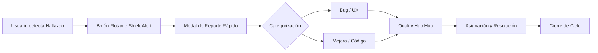

# 🛡️ Stratos Quality Hub & Continuous Improvement System

El **Quality Hub** es el motor de garantía de calidad y mejora continua de Stratos. Está diseñado para cerrar la brecha entre el uso diario del sistema y el ciclo de desarrollo, permitiendo una captura de feedback en tiempo real y una gestión estructurada de la evolución del software.

## 📌 Filosofía del Sistema

No se trata solo de un gestor de errores; es una herramienta de **Excelencia Operacional**. El sistema categoriza cada entrada en cuatro pilares:

1.  **Bug (Error):** Comportamientos inesperados que degradan la experiencia.
2.  **Improvement (Oportunidad de Mejora):** Sugerencias para evolucionar funcionalidades existentes.
3.  **Code Quality (Calidad técnica):** Hallazgos de deuda técnica o refactorizaciones necesarias.
4.  **UX (Experiencia de Usuario):** Feedback sobre usabilidad, diseño y fricción.

---

## 🏗️ Arquitectura Técnica

### 1. Modelo de Datos (`SupportTicket`)

Ubicación: `app/Models/SupportTicket.php`

- **Multi-tenant:** Cada ticket está ligado a una `organization_id`.
- **Contexto Automático:** Almacena en formato JSON (`context`) datos como:
    - URL donde se generó el reporte.
    - User Agent (Navegador/OS).
    - Resolución de pantalla.
- **Trazabilidad:** Relaciones definidas con `reporter` (quién lo vio) y `assignee` (quién lo resuelve).

### 2. Capa de API

Ubicación: `app/Http/Controllers/Api/SupportTicketController.php`

- **Metrics Endpoint:** Proporciona datos agregados para el dashboard de calidad.
- **Políticas de Acceso:**
    - Usuarios estándar: Pueden crear y ver sus propios tickets/tickets de su organización.
    - Admin/HR Leader: Acceso total al Hub de gestión.

### 3. Frontend (Vue.js + Tailwind + Glassmorphism)

- **Global Reporting Action:** Un botón flotante persistente en `AppSidebarLayout.vue` garantiza que el feedback nunca esté a más de un clic de distancia.
- **Reporting Modal:** Un componente optimizado para la rapidez, que minimiza la carga cognitiva del usuario al reportar.
- **Quality Hub Page:** Panel centralizado con KPIs de salud del sistema y tracking de resolución.

---

## 📈 Flujo de Q&A (Quality Assurance)



## 🛠️ Guía de Mantenimiento

### Rutas Clave

- **Web:** `/quality-hub`
- **API:**
    - `GET /api/support-tickets` (Lista)
    - `GET /api/support-tickets/metrics` (Estadísticas)
    - `POST /api/support-tickets` (Creación)

### Comandos de Base de Datos

Si necesitas resetear o migrar la tabla de tickets:

```bash
php artisan migrate --path=database/migrations/2026_03_07_020048_create_support_tickets_table.php
```

---

> [!NOTE]
> Este sistema es parte fundamental de la fase de **Estabilidad y Confiabilidad** de Stratos, asegurando que la plataforma no solo sea innovadora, sino también robusta y libre de fricciones.
