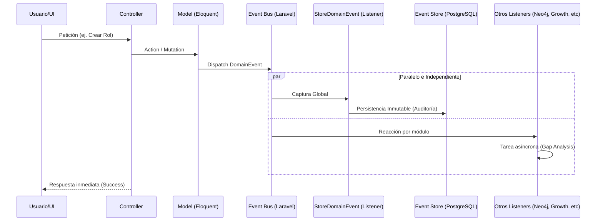

# 🏗️ Arquitectura de Eventos Estratégicos y Event Store (Stratos)

## 1. Introducción y Filosofía

La **Arquitectura de Eventos Interna** de Stratos representa una evolución desde un modelo monolítico transaccional hacia un sistema **orientado a eventos (EDA - Event-Driven Architecture)** con una implementación de **Event Sourcing Lite**.

### El Problema del Acoplamiento

Tradicionalmente, cuando un usuario crea un "Rol" en Stratos, el controlador debe:

1. Guardar el rol en Postgres.
2. Sincronizarlo con Neo4j.
3. Notificar al motor de Gap Analysis.
4. Generar una alerta para el Manager.

Si cualquiera de estos pasos falla o tarda demasiado, la experiencia del usuario se degrada.

### La Solución: Desacoplamiento Reactivo

En el nuevo esquema, el sistema simplemente dice: **"Ha ocurrido un evento: `RoleRequirementsUpdated`"**. Otros módulos de la plataforma, que están "escuchando", reaccionan a este hecho de forma asíncrona y aislada.

---

## 2. Componentes del Ecosistema de Eventos

### 🛠️ 2.1 Clase Base: `DomainEvent`

Localización: `app/Events/DomainEvent.php`

Cada acción estratégica significativa en Stratos debe ser un `DomainEvent`. Esta clase abstracta garantiza que cada evento contenga metadatos inmutables idénticos para propósitos de auditoría y análisis sistémico:

- **`eventId` (UUID)**: Identificador único universal de la ocurrencia.
- **`occurredAt` (Timestamp ISO8601)**: El momento exacto del hecho.
- **`aggregateId` (ID)**: El ID de la entidad principal (ej. `role_id=45`).
- **`aggregateType` (Class)**: La clase de la entidad (ej. `App\Models\Roles`).
- **`organizationId` (Tenant)**: Obligatorio para garantizar el aislamiento multitenant.
- **`actor_id`**: El usuario que disparó la acción (capturado automáticamente del contexto de Auth).
- **`payload` (JSON)**: Los datos específicos de la mutación.

### 🧬 2.2 Trait: `HasDomainEvents`

Localización: `app/Traits/HasDomainEvents.php`

Este Trait permite que cualquier Modelo de Eloquent se convierta en una fuente de eventos de dominio. Provee métodos para:

- `recordDomainEvent()`: Adjunta un evento al modelo antes de ser despachado.
- `releaseDomainEvents()`: Libera los eventos pendientes.
- `dispatchDomainEvents()`: Despacha todos los eventos acumulados hacia el Bus.

### 📦 2.3 El Event Store (Side-car Event Sourcing)

Localización: `app/Models/EventStore.php` | Tabla: `event_store`

A diferencia del Sourcing puro (sustituir DB por logs), Stratos utiliza un "Side-car". Cada evento que cruza el bus es capturado por el listener global `StoreDomainEvent` y guardado permanentemente.

| Campo             | Propósito                                    |
| :---------------- | :------------------------------------------- |
| `id`              | UUID del Evento                              |
| `event_name`      | Identificador del hecho (ej: `role.created`) |
| `aggregate_type`  | Modelo afectado                              |
| `aggregate_id`    | ID de la entidad                             |
| `organization_id` | Tenant dueño del dato                        |
| `actor_id`        | Responsable de la acción                     |
| `payload`         | Estado de la mutación                        |
| `occurred_at`     | Tiempo real de ejecución                     |

---

## 3. Ciclo de Vida de un Evento en Stratos



---

## 4. Guía de Implementación para Desarrolladores

### Paso 1: Crear el Evento

Crea una clase en `app/Events` que extienda de `DomainEvent`.

```php
namespace App\Events;

class RoleCreated extends DomainEvent {
    public function eventName(): string {
        return 'role.created';
    }
}
```

### Paso 2: Registrar el Evento en el Modelo

Añade el Trait al modelo correspondiente.

```php
use App\Traits\HasDomainEvents;

class Roles extends Model {
    use HasDomainEvents;
}
```

### Paso 3: Disparar desde el Servicio/Controlador

Usa el método `dispatch` o acumula bajo demanda.

```php
// En un Controlador o Job
RoleRequirementsUpdated::dispatch($roleId, $orgId, ['field' => 'competency_list']);
```

---

## 5. El Futuro: Agentes Reactivos

Esta arquitectura es la base para los **Agentes de Inteligencia Artificial Reactivos** de Stratos. En lugar de que la IA sea una herramienta pasiva que espera un botón, los Agentes pueden ahora estar subscritos al `EventStore`.

**Escenario de ejemplo:**

1. Un Gerente actualiza los requerimientos de un rol crítico (`RoleRequirementsUpdated`).
2. El `EventStore` registra el cambio.
3. Un **Agente Analítico de Sucesión** detecta el evento automáticamente.
4. Antes de que el Gerente cierre sesión, el Agente le envía una notificación:
   _"He notado que has subido el nivel de exigencia para el rol de Director; acabo de recalcular el mapa de talento y te presento 3 candidatos internos que cumplen con este nuevo criterio"._

---

> [!IMPORTANT]
> **Regla de Oro**: Ninguna acción estratégica destructiva o de alta importancia (Cambios en roles, competencias, evaluaciones, presupuestos) debe ocurrir sin disparar un `DomainEvent`. La inmutabilidad del `EventStore` es nuestra única fuente de verdad ante auditorías de cumplimiento y análisis de evolución histórica.
