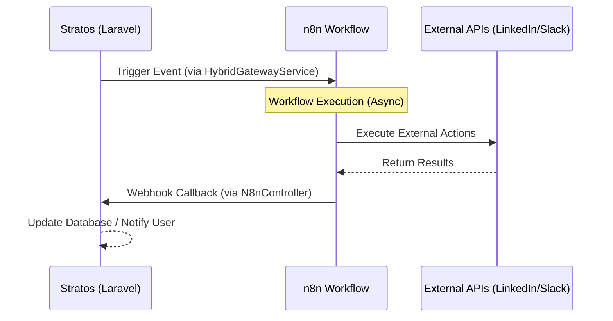

# 🤖 n8n Automation Orchestration - Stratos Technical Guide

## 📌 Overview

Stratos utilizes **n8n** as its primary external orchestration engine. This allows the platform to extend its capabilities beyond typical request-response cycles, enabling complex, multi-step workflows like automated recruiting, deep talent research, and cross-platform notifications without bloating the core Laravel application.

---

## 🏗️ Bidirectional Architecture

The integration is built on a **Fire-and-Forget (Outbound)** and **Callback (Inbound)** pattern.

### 1. High-Level Data Flow



---

## 🛰️ Outbound: Triggering Workflows from Stratos

Use the `HybridGatewayService` to send events to n8n. This service is designed to be lightweight and fail-safe.

### 🔌 Service Implementation

**Path**: `app/Services/HybridGatewayService.php`

### 💻 Usage Example

To trigger an automation when a new strategic scenario is finalized:

```php
use App\Services\HybridGatewayService;

public function finalize(Scenario $scenario, HybridGatewayService $gateway) {
    // ... core logic ...

    $gateway->triggerExternalWorkflow('scenario_finalized', [
        'id' => $scenario->id,
        'name' => $scenario->name,
        'iq_score' => $scenario->iq_score,
        'strategies' => $scenario->strategies->pluck('type'),
    ]);
}
```

### ⚙️ Environment Configuration

Add these to your `.env` file:

```env
N8N_WEBHOOK_URL=https://n8n.yourdomain.com/webhook/stratos-events
N8N_SECRET=a_very_long_random_secure_token
```

---

## 📥 Inbound: Handling Callbacks from n8n

The `N8nController` acts as the secure entry point for n8n to report back results.

**Endpoint**: `POST /api/automation/webhooks/n8n`

### 🔒 Security & Validation

Stratos enforces security through a shared secret. n8n **must** send the following header in every request:

- **Header**: `X-N8n-Secret`
- **Value**: Must match the `N8N_SECRET` in Stratos.

### 📦 Expected Request Structure

The controller expects a JSON payload:

```json
{
    "event": "workflow_step_completed",
    "payload": {
        "action_id": "job_post_001",
        "status": "published",
        "url": "https://linkedin.com/jobs/..."
    }
}
```

---

## 🔧 Future Workflow Implementations

| Use Case                   | Trigger Event            | n8n Action                                                                        |
| :------------------------- | :----------------------- | :-------------------------------------------------------------------------------- |
| **Recruitment Automation** | `strategy_buy_approved`  | Formats job description -> Posts to LinkedIn API -> Aggregates applicants.        |
| **Skill Enrichment**       | `talent_profile_created` | Scrapes GitHub/Portfolio -> Identifies missing skills -> Updates Stratos via API. |
| **Executive Alerts**       | `critical_risk_detected` | Formats "War-Room" alert -> Sends to dedicated Slack/Teams channel.               |
| **Budget Sync**            | `simulation_completed`   | Exports cost projections -> Updates Finance Department's Excel/ERP.               |

---

## 🛠️ Troubleshooting

- **Check Logs**: Detailed logs are kept in `storage/logs/laravel.log`. Search for `[Hybrid Gateway]` or `[n8n Webhook]`.
- **Secret Mismatch**: If you receive a `401 Unauthorized`, verify that the `X-N8n-Secret` header in n8n matches exactly what is in the Stratos `.env`.
- **Timeout**: The outbound gateway has a 5-second timeout. Ensure n8n is responsive or receives the call asynchronously.

## 🚀 Status

- [x] **Infrastructure**: Configured in `config/services.php`.
- [x] **Outbound**: `HybridGatewayService` active.
- [x] **Inbound**: `N8nController` and Routes registered.
- [x] **Security**: Middleware/Secret verification implemented.
