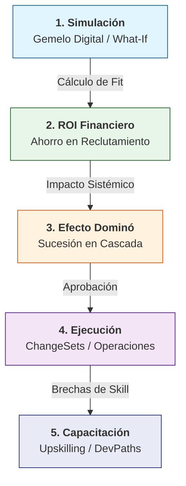

# 🌐 Simulación de Movilidad Estratégica (Gemelo Digital)

## 📌 Resumen Conceptual

La **Simulación de Movilidad Estratégica** es una de las capacidades más avanzadas del ecosistema Stratos. Funciona como un **Gemelo Digital de Talento** que permite a los líderes de Recursos Humanos y Gerentes Estratégicos modelar movimientos de personal en un entorno seguro antes de implementarlos en la realidad.

A diferencia de un organigrama tradicional, esta simulación es **dinámica y predictiva**, utilizando los datos provenientes de la psicometría inferencial (BEI) y el análisis de brechas (Gap Analysis).

---

## 🏗️ Arquitectura de la Simulación

### 1. El Motor de Simulación (`MobilitySimulatorEngine`)

El backend utiliza un servicio especializado que procesa tres variables críticas para cada movimiento:

- **Match de Capacidad (Fit Score):** Compara el perfil psicométrico y de habilidades del colaborador con el `JobProfile` de destino.
- **Índice de Fricción (Transition Cost):** Calcula la complejidad del movimiento basándose en la distancia entre el rol actual y el nuevo (upskilling necesario) y la pérdida de productividad inicial.
- **Impacto Residual (Legacy Risk):** Evalúa cómo queda el equipo de origen. Si el colaborador era un "Single Point of Failure" (único poseedor de una habilidad crítica), el sistema emite una alerta de riesgo.

### 2. Capas de Inteligencia

- **Predictor de Éxito:** Utiliza IA para proyectar la probabilidad de éxito en el nuevo rol a 6 meses.
- **Asesor Estratégico IA:** Un agente especializado ("Simulador Orgánico") que genera planes de movilidad completos (personas y roles) basados en objetivos de negocio (ej: "Optimizar equipo para expansión a Latam").
- **Analítica "What-If":** Permite guardar múltiples versiones (escenarios) de una reestructuración para comparar su ROI y su impacto en el **Scenario IQ** organizacional.

---

## 🚀 Flujo de Trabajo Sugerido

1.  **Selección de Objetivo:** Definir si la movilidad es para una "Unidad de Innovación", una "Reestructuración" o un "Plan de Sucesión".
2.  **Modelado:** Arrastrar talentos detectados (ej. High Potentials) a las nuevas posiciones.
3.  **Validación de IA:** Solicitar al agente de Stratos un análisis de los "Puntos Ciegos" de la nueva estructura.
4.  **Ejecución (Incubación):** Una vez aprobado el escenario, las acciones se envían al módulo de **Incubación** para generar las órdenes de cambio (ChangeSets).

---

## 🛠️ Detalles de Implementación (Actualizado)

La primera fase de la Simulación de Movilidad ya ha sido integrada en el núcleo de Stratos.

### 1. Motor de Simulación (`MobilitySimulationService`)

El servicio backend (`app/Services/Talent/MobilitySimulationService.php`) procesa la lógica algorítmica:

- **Fit Score:** Alineación técnica y psicométrica.
- **Índice de Fricción:** Dificultad de la transición basada en cercanía de roles y tamaño del equipo.
- **Riesgo de Legado:** Probabilidad de desestabilización del equipo origen.
- **ROI Basado en Nómina:** Los cálculos financieros ahora consideran el `base_salary` configurado en el Rol y el `salary` real del colaborador para mayor precisión.
- **Salud Departamental:** Evaluación orgánica de cada unidad de negocio (`health_score`) basada en densidad de HiPo y cobertura de skills.

### 2. Controlador y API (`MobilitySimulationController`)

El controlador gestiona las interacciones entre la UI y el motor de simulación:

- `POST /api/strategic-planning/mobility/simulate`: Ejecuta la proyección individual, masiva o multirrol (mediante array de `movements`).
- `POST /api/mobility/ai-suggestions`: Invoca al Advisor de IA para generar propuestas estratégicas basadas en un objetivo textual.
- `GET /api/mobility/execution-status`: Recupera el progreso financiero y formativo de los planes materializados.
- `GET /api/strategic-planning/mobility/organization-impact`: Genera un snapshot del mapa de calor de salud de todos los departamentos.
- `POST /api/strategic-planning/mobility/save-scenario`: Persiste los resultados de una simulación como un `Scenario` formal.
- `POST /api/strategic-planning/mobility/scenarios/{id}/materialize`: Convierte un escenario guardado en un `ChangeSet` ejecutable, capturando métricas de ROI en metadatos.

### 3. Interfaz "War-Room" (`MobilityWarRoom.vue`)

Localizada en `resources/js/pages/Talento360/MobilityWarRoom.vue`, ofrece:

- **Dashboard Neural:** Interfaz visual con efectos de glassmorphism y animaciones de transición.
- **Asesor IA Integrado:** Panel interactivo para ingresar objetivos estratégicos y recibir planes detallados de movimiento de personal.
- **Heatmap de Salud:** Visualización en tiempo real del riesgo y estabilidad departamental.
- **Seguimiento de Ejecución:** Pantalla dedicada para monitorear el progreso de upskilling y el ROI real vs. proyectado de los planes aplicados.

---

## 🎨 Interfaz de Usuario: Central de Movilidad (War-Room)

La UI adopta una estética **Neural/Glassmorphic** para transmitir una sensación de sistema vivo y conectado.

### Elementos Clave de la Interfaz:

1.  **Selector de Talento Dinámico:** Búsqueda y selección de colaboradores y roles destino con feedback inmediato.
2.  **Impact Pulse (Indicador de Salud):**
    - **Probabilidad de Éxito:** Métrica agregada de viabilidad.
    - **Mapa de Calor Departamental:** Listado de departamentos con indicadores de salud (Verde/Amarillo/Rojo).
3.  **Roadmap de Transición:** Proyección visual de las fases de adaptación (Inmersión -> Productividad -> Dominio).

---

### 4. Calculadora de ROI Financiero

Integrada en el motor para justificar económicamente cada movimiento de talento:

- **Recruitment Avoidance:** Proyección del costo ahorrado al cubrir posiciones internamente vs. contratación tradicional (calculado como el 20% del salario anual del rol destino).
- **Internal Transition Cost:** Inversión estimada en capacitación, rampa de aprendizaje y pérdida temporal de productividad debido a la fricción del cambio.
- **ROI Neto Organizacional:** Balance financiero directo de la estrategia de movilidad, visible en el dashboard del War-Room.

### 5. Simulación de "Efecto Dominó" (Sucesión Interna)

Capacidad predictiva para gestionar el impacto sistémico de las vacantes generadas:

- **Identificación Automática de Vacantes:** Al mover un colaborador, el sistema marca su posición original como "Crítica" o "Vacante".
- **Internal Succession Matching:** El motor busca proactivamente en toda la base de talento los 3 perfiles internos con mayor "Fit Score" para cubrir el hueco dejado.
- **Cadenas de Reacción:** Permite visualizar cómo un movimiento estratégico de un líder puede ser resuelto mediante una cascada de promociones internas optimizadas.

### 6. Ejecución y ChangeSets (Materialización)

Una vez que un escenario es validado, el sistema permite la "Materialización", que genera un registro de cambios (`ChangeSet`) con las siguientes operaciones atómicas:

- **`move_person`**: Actualiza el `role_id` del colaborador. Soporta múltiples destinos en un solo plan.
- **`create_vacancy`**: Genera un registro en `JobOpening` para cubrir huecos críticos.
- **`create_development_plan`**: Crea automáticamente rutas de capacitación asociadas al movimiento para cerrar brechas de habilidades detectadas.

El ChangeSet almacena el **ROI Proyectado** y los **Ahorros Estimados** en sus metadatos, permitiendo auditar el valor generado por la movilidad de inicio a fin.

---

## � Referencia Técnica de Servicios

### `MobilityAIAdvisorService`

- **`suggestStrategicMovements(int orgId, string objective)`**: Orquestador principal. Consulta al agente "Simulador Orgánico" con el contexto de la empresa y devuelve una propuesta JSON con talentos y roles destino.
- **Contexto Inyectado**: Envía a la IA la lista de departamentos activos, sus misiones y las fortalezas de los colaboradores clave.

### `MobilitySimulationService`

- **`simulateMovement(int personId, int targetRoleId)`**: Cálculo atómico de Fit Score, Fricción y Riesgo de Legado.
- **`simulatePlannedMovements(array movements)`**: Ejecución masiva de planes estructurados con múltiples destinos.
- **`calculateROI(float targetSalary, ?People person)`**: Lógica financiera que prioriza salarios reales de nómina.
- **`findPotentialSuccessors(Roles role, array excludedIds, int depth)`**: Algoritmo recursivo para el efecto dominó (hasta 3 niveles).

---

## 📖 Guía de Usuario: "War-Room" de Movilidad

### Paso 1: Definición del Objetivo

Ingrese un requerimiento de negocio en el panel de IA (ej: _"Necesito potenciar el área de Producto con gente que ya conozca la cultura pero tenga experiencia técnica"_).

### Paso 2: Análisis de Propuesta

La IA devolverá una lista de candidatos. Revise el **Racional Estratégico** para entender el porqué de cada sugerencia. Haga clic en **"Aplicar Sugerencias"** para cargar el plan en el simulador.

### Paso 3: Validación del Gemelo Digital

Observe el **Impacto en la Salud Organizacional**. Si un departamento entra en "Rojo", la IA le advertirá sobre el riesgo de pérdida de conocimiento crítico.

### Paso 4: Materialización y Seguimiento

Una vez validado, active **"Materializar Plan"**. El sistema creará un seguimiento de ejecución donde podrá monitorear el progreso de los colaboradores en sus nuevas posiciones y el ROI real acumulado.

---

## �🔄 El Ecosistema de Movilidad: Flujo de Valor

El proceso de movilidad estratégica en Stratos no es una acción aislada, sino un ciclo de valor de extremo a extremo que conecta la estrategia financiera con el desarrollo individual.

### Descripción Detallada del Ciclo:

#### 1. Simulación (Modeling & Prediction)

El punto de partida donde el líder experimenta en el **Gemelo Digital**. Stratos calcula el **Fit Score** (afinidades psicométricas y técnicas) y el **Legacy Risk** (qué tan vulnerable queda el área de origen). Es un entorno "sandbox" sin impacto real en la base de datos.

#### 2. Análisis de ROI (Financial Justification)

Cada movimiento proyectado activa un motor financiero. Se calcula el **Recruitment Avoidance** (cuánto dinero se ahorra la empresa al no ir al mercado externo) vs el **Transition Cost** (costo de la curva de aprendizaje). Esto permite presentar la movilidad como una decisión de negocio rentable.

#### 3. Efecto Dominó & Cascada (Systemic Stability)

Stratos predice la reacción en cadena. Al mover a una persona, se genera una vacante; el sistema busca inmediatamente el mejor sucesor interno para ese hueco, y para el hueco del sucesor, hasta **3 niveles de profundidad**. El objetivo es minimizar la "vacancia crítica".

#### 4. Ejecución: ChangeSets (Materialization)

Cuando el escenario se aprueba, se "materializa". El sistema genera un **ChangeSet** con operaciones atómicas (`move_person`, `create_vacancy`). Esto asegura una transición limpia, auditable y reversible si fuera necesario, sin errores manuales de actualización de registros.

#### 5. Capacitación: Upskilling (Automated Development)

El paso final del ciclo. Si la persona no tiene el 100% de los skills para su nuevo rol, el proceso de materialización crea automáticamente un **DevelopmentPath**. El colaborador recibe un plan de entrenamiento con acciones específicas para cerrar las **brechas detectadas** durante la simulación, garantizando el éxito a largo plazo.

---

## Próximos Pasos Sugeridos

1. **Integración Directa con LMS**: Conectar el `DevelopmentPath` generado con cursos reales del catálogo de la organización.
2. **Visualización en Red (Graph View)**: Mapa visual de las conexiones del Efecto Dominó para ver la propagación del cambio.
3. **Escenarios Multivariables**: Comparación automática de planes (Plan A: Optimizar Costos vs Plan B: Optimizar Innovación).

---

## 📊 Métricas de Éxito (KPIs de Movilidad)

- **Mobility ROI:** Ahorro financiero total proyectado por el escenario.
- **Transition Efficiency:** Porcentaje de efectividad del costo de transición vs. costo externo.
- **Domino Coverage:** Porcentaje de vacantes secundarias que pueden cubrirse internamente.
- **Systemic Health Delta:** Impacto neto en la estabilidad de la organización tras una reestructuración.
- **Success Probability:** Índice predictivo de adaptación al nuevo rol/departamento.
