# 🏗️ Verification Hub - Arquitectura del Sistema

## Diagrama General del Sistema

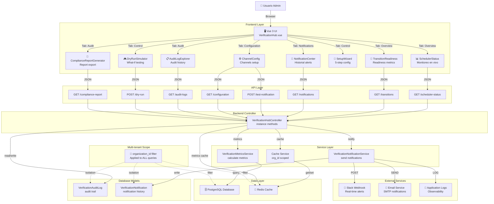

---

## Flujo de Datos Detallado

### 1. Flujo de Lectura (Monitoreo)

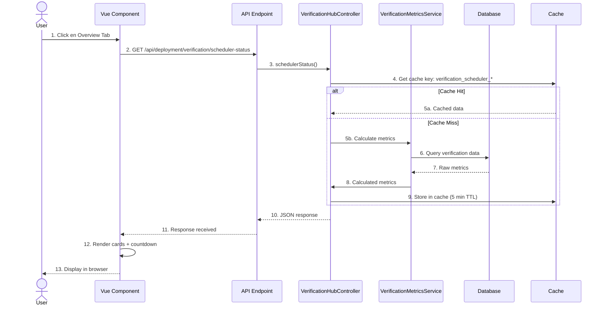

### 2. Flujo de Acción (Configuración)

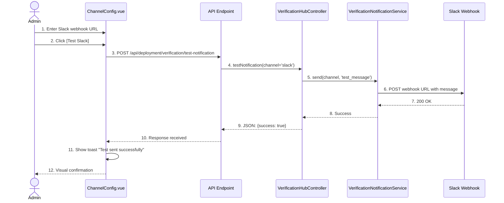

### 3. Flujo de Dry-Run Simulation

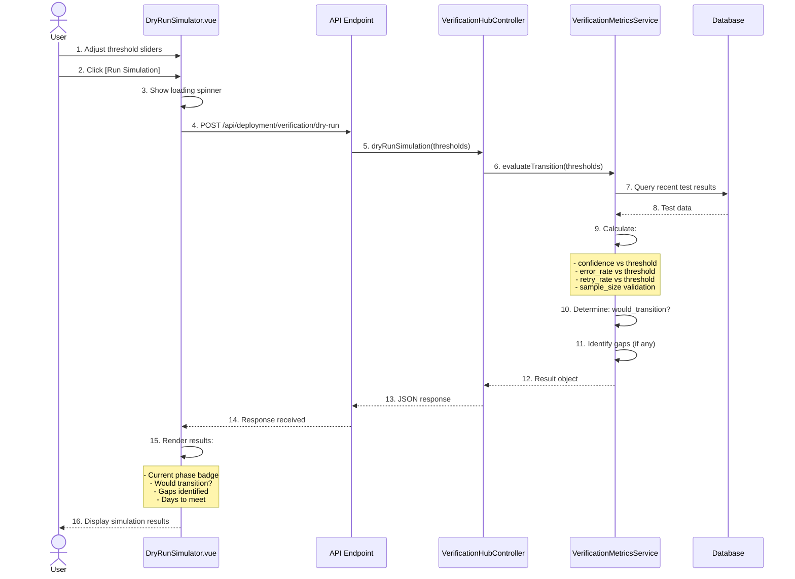

### 4. Flujo de Auditoría

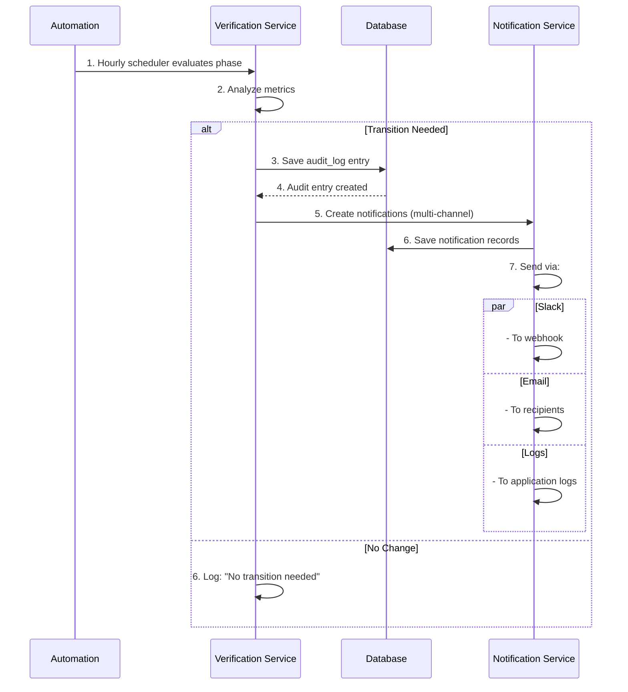

---

## Mapa de Componentes

### Frontend Components Tree

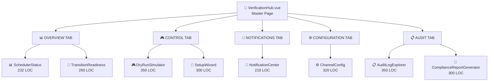

### Component Dependency Graph

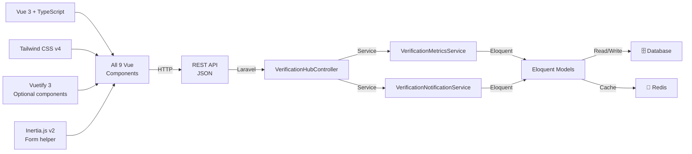

---

## Data Flow Architecture

### State Management Pattern

```mermaid
graph TB
    Component["Vue Component"]
    LocalState["Local State<br/>ref, computed"]
    APICall["API Call<br/>fetch/axios"]
    Cache["Redis Cache<br/>5-60 min TTL"]
    Database["PostgreSQL<br/>Persistent storage"]

    Component -->|fetch| LocalState
    Component -->|GET /api/*| APICall
    APICall -->|org_id scoped| Cache
    alt Cache Hit
        Cache -->|Data| APICall
    else Cache Miss
        Cache -->|Query| Database
        Database -->|Results| Cache
        Cache -->|Data| APICall
    end
    APICall -->|JSON| Component
    Component -->|Update| LocalState
    Component -->|Display| Browser["🖥️ Browser DOM"]
```

### Multi-Tenant Scoping (Critical)

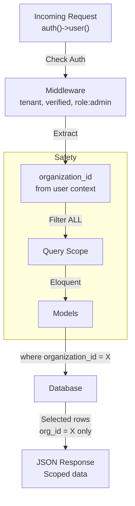

---

## Sequence of Operations

### Daily Operational Flow

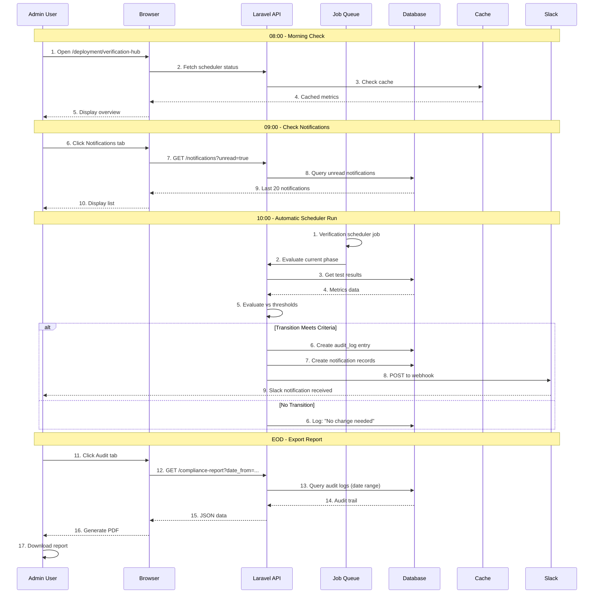

---

## Security Architecture

### Authentication & Authorization

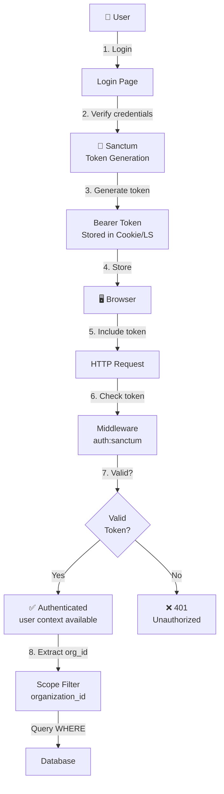

### Data Isolation (Multi-tenant)

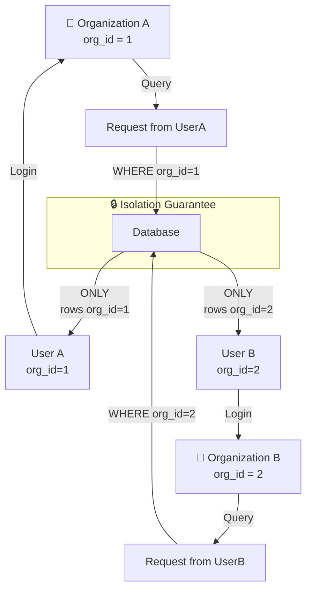

---

## Performance Optimization

### Caching Strategy

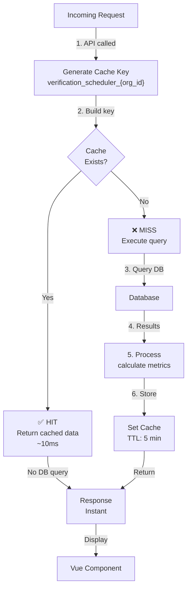

### Query Optimization

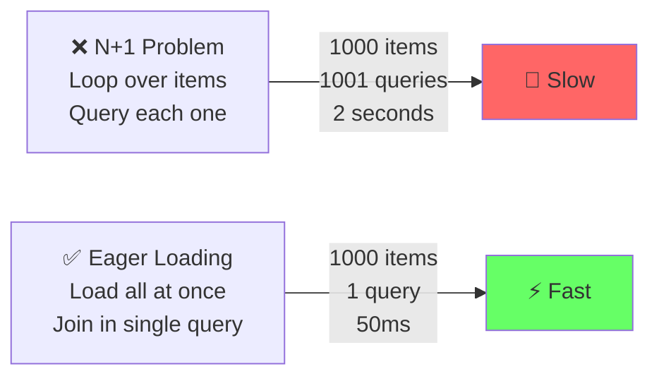

---

## Deployment Architecture

### Environment Stages

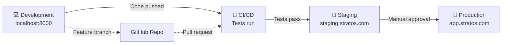

### File Structure

```
src/
├── app/
│   └── Http/Controllers/Deployment/
│       └── VerificationHubController.php (430 LOC)
│
├── resources/js/
│   ├── Pages/Deployment/
│   │   └── VerificationHub.vue (master)
│   │
│   └── components/Verification/
│       ├── SchedulerStatus.vue
│       ├── NotificationCenter.vue
│       ├── ChannelConfig.vue
│       ├── TransitionReadiness.vue
│       ├── DryRunSimulator.vue
│       ├── SetupWizard.vue
│       ├── AuditLogExplorer.vue
│       └── ComplianceReportGenerator.vue
│
└── routes/
    └── web.php (API routes + web route)
```

---

## Metrics & Monitoring

### Key Performance Indicators

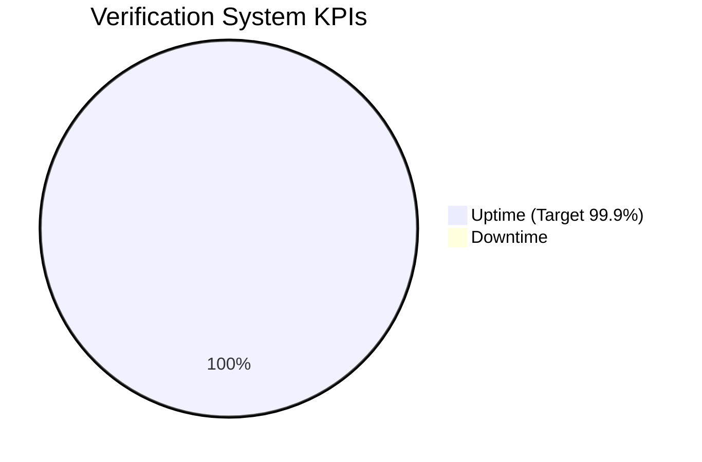

### Health Checks

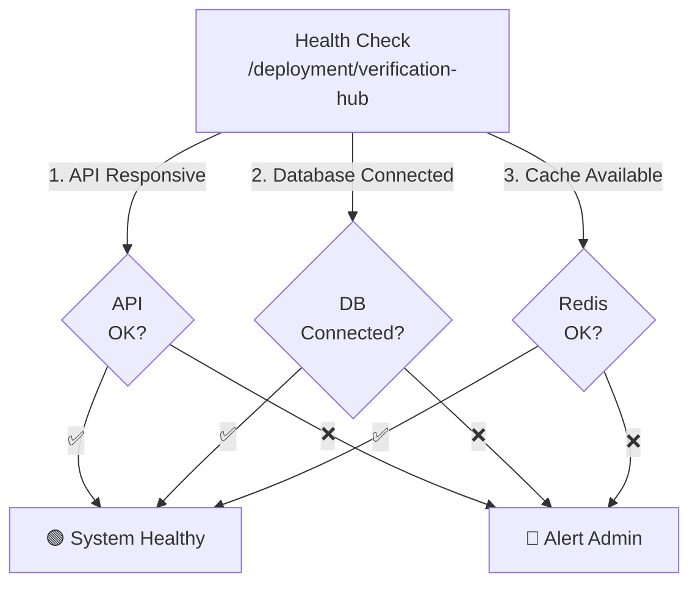

---
