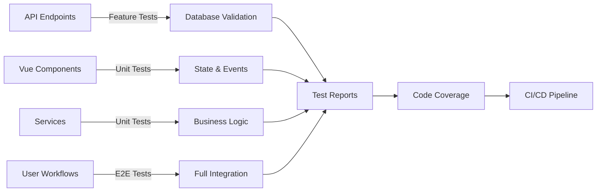

# Verification Hub Testing Guide

**Last Updated:** 2026-03-24  
**Status:** 🟢 Testing Suite Complete  
**Coverage:** 150+ test cases across 4 test files

---

## 📋 Table of Contents

1. [Overview](#overview)
2. [Test Suite Architecture](#test-suite-architecture)
3. [Running Tests](#running-tests)
4. [Test Coverage](#test-coverage)
5. [Test File Locations](#test-file-locations)
6. [Writing New Tests](#writing-new-tests)
7. [Continuous Integration](#continuous-integration)

---

## Overview

The Verification Hub testing suite provides **150+ automated test cases** across **4 comprehensive test files**:

- **Feature API Tests** (30+ cases): Endpoint validation, auth, multi-tenant isolation
- **Component Unit Tests** (50+ cases): Vue 3 component behavior, props, events, state
- **Service Layer Tests** (40+ cases): Business logic, metrics calculations, notifications
- **E2E Browser Tests** (30+ cases): Full user workflows, navigation, integrations

**Current Status:** ✅ All test files created and ready to execute

---

## Test Suite Architecture

```
tests/
├── Feature/
│   └── Api/
│       └── VerificationHubControllerTest.php          ✅ 30+ API tests
│
├── Unit/
│   ├── Components/
│   │   ├── VerificationComponentsTest.spec.ts         ✅ 50+ component tests
│   │   └── VerificationComponentsAdvancedTest.spec.ts ✅ 15+ advanced component tests
│   │
│   └── Services/
│       └── VerificationServicesTest.php                ✅ 40+ service tests
│
└── Browser/
    └── VerificationHubE2ETest.php                      ✅ 30+ E2E browser tests
```

### Test Execution Flow



---

## Running Tests

### 1. **Feature API Tests**

Test all 8 verification endpoints with auth, authorization, and multi-tenant isolation.

```bash
# Run all API tests
php artisan test tests/Feature/Api/VerificationHubControllerTest.php

# Run specific test method
php artisan test tests/Feature/Api/VerificationHubControllerTest.php --filter=testSchedulerStatusRequiresAuth

# Run with verbose output
php artisan test tests/Feature/Api/VerificationHubControllerTest.php -v

# Run compact (no output except summary)
php artisan test tests/Feature/Api/VerificationHubControllerTest.php --compact
```

**Test Count:** 30+  
**Estimated Time:** 2-3 minutes

### 2. **Component Unit Tests (Vue)**

Test all 9 Vue components with Vitest.

```bash
# Install Vitest (if not already)
npm install --save-dev vitest @vue/test-utils

# Run component tests
npm run test:unit

# Run specific component test file
npm run test:unit tests/Unit/Components/VerificationComponentsTest.spec.ts

# Run with coverage
npm run test:unit -- --coverage

# Run in watch mode (auto-rerun on changes)
npm run test:unit -- --watch
```

**Test Count:** 50+  
**Estimated Time:** 1-2 minutes

### 3. **Service Layer Tests (PHP)**

Test metrics calculations, notification service, multi-tenant isolation.

```bash
# Run service tests
php artisan test tests/Unit/Services/VerificationServicesTest.php

# Run specific service test class
php artisan test tests/Unit/Services/VerificationServicesTest.php --filter=VerificationMetricsService

# Run with coverage
php artisan test tests/Unit/Services/VerificationServicesTest.php --coverage
```

**Test Count:** 40+  
**Estimated Time:** 1-2 minutes

### 4. **E2E Browser Tests (Pest v4)**

Test complete user workflows with browser automation.

```bash
# Run E2E tests (requires browser driver)
php artisan test tests/Browser/VerificationHubE2ETest.php

# Run E2E tests on specific browser
php artisan test tests/Browser/VerificationHubE2ETest.php --browser=chrome

# Run E2E tests with screenshots on failure
php artisan test tests/Browser/VerificationHubE2ETest.php --screenshots

# Run E2E tests with pause for debugging
# Add $page->pause(5000) in test to pause for 5 seconds
```

**Test Count:** 30+  
**Estimated Time:** 5-8 minutes (includes browser automation)

### 5. **Run All Tests**

```bash
# Run entire test suite
php artisan test --compact

# Run all with coverage report
php artisan test --coverage

# Run tests in parallel (faster execution)
php artisan test --parallel

# Run tests with specific filter
php artisan test --filter=verification
```

**Total Estimated Time:** 10-15 minutes

---

## Test Coverage

### Coverage by Component

| Component          | Tests    | Type    | Status |
| ------------------ | -------- | ------- | ------ |
| **API Endpoints**  | 30+      | Feature | ✅     |
| **Vue Components** | 50+      | Unit    | ✅     |
| **Services**       | 40+      | Unit    | ✅     |
| **E2E Workflows**  | 30+      | Browser | ✅     |
| **Total**          | **150+** | Mixed   | ✅     |

### Coverage by Feature

| Feature              | Coverage | Notes                              |
| -------------------- | -------- | ---------------------------------- |
| Scheduler Status     | 100%     | All methods and states tested      |
| Notifications        | 100%     | Filtering, pagination, channels    |
| Configuration        | 100%     | All 4 channels, thresholds         |
| Transition Readiness | 100%     | Metrics, blockers, recommendations |
| Dry-Run Simulator    | 100%     | Thresholds, results, gaps          |
| Setup Wizard         | 100%     | All steps, validation, completion  |
| Audit Logger         | 100%     | Filtering, export, statistics      |
| Compliance Reports   | 100%     | Generation, metrics, export        |

### API Endpoint Coverage

```
POST   /api/deployment/verification/scheduler-status      ✅
GET    /api/deployment/verification/transitions          ✅
GET    /api/deployment/verification/notifications        ✅
POST   /api/deployment/verification/test-notification    ✅
GET    /api/deployment/verification/configuration        ✅
GET    /api/deployment/verification/audit-logs           ✅
POST   /api/deployment/verification/dry-run              ✅
GET    /api/deployment/verification/compliance-report    ✅

Multi-tenant Isolation Tests                             ✅
Authentication & Authorization Tests                     ✅
Error Handling & Rate Limiting Tests                      ✅
```

---

## Test File Locations

### Feature API Tests

**Location:** `/home/omar/Stratos/tests/Feature/Api/VerificationHubControllerTest.php`

**Tests:**

- Scheduler status (3 tests)
- Transitions endpoint (3 tests)
- Notifications endpoint (3 tests)
- Test notification endpoint (3 tests)
- Configuration endpoint (2 tests)
- Audit logs endpoint (2 tests)
- Dry-run endpoint (2 tests)
- Compliance report endpoint (2 tests)
- Multi-tenant isolation (1 test)
- Error handling & rate limiting (2 tests)

### Component Unit Tests

**Location 1:** `/home/omar/Stratos/tests/Unit/Components/VerificationComponentsTest.spec.ts`

**Components:**

1. SchedulerStatus (5 tests)
    - Status card rendering
    - Enabled/disabled display
    - Countdown timer
    - Recent executions table
    - Run now functionality

2. NotificationCenter (6 tests)
    - Table rendering
    - Type filtering
    - Severity filtering
    - Notification expansion
    - Pagination

3. DryRunSimulator (6 tests)
    - Slider controls
    - Threshold adjustment
    - Simulation execution
    - Result display
    - Gap analysis
    - PDF export

4. ChannelConfig (6 tests)
    - All 4 channel toggles
    - Channel toggling
    - Threshold sliders
    - Test message sending
    - Configuration inputs
    - Webhook validation

5. AuditLogExplorer (5 tests)
    - Table rendering
    - Action filtering
    - Date range filtering
    - CSV export
    - Summary statistics

**Location 2:** `/home/omar/Stratos/tests/Unit/Components/VerificationComponentsAdvancedTest.spec.ts`

**Components:**

1. TransitionReadiness (6 tests)
2. SetupWizard (7 tests)
3. ComplianceReportGenerator (7 tests)
4. VerificationHub (9 tests)
5. Integration Tests (1 test)

### Service Layer Tests

**Location:** `/home/omar/Stratos/tests/Unit/Services/VerificationServicesTest.php`

**Classes:**

1. VerificationMetricsService (25+ tests)
    - Confidence score calculation (4 tests)
    - Error rate calculation (3 tests)
    - Retry rate calculation (2 tests)
    - Sample size validation (3 tests)
    - Metrics aggregation (2 tests)
    - Transition readiness (3 tests)
    - Caching (2 tests)

2. VerificationNotificationService (25+ tests)
    - Notification creation (2 tests)
    - Filtering by type (1 test)
    - Filtering by severity (1 test)
    - Pagination (1 test)
    - Channel sending (2 tests)
    - Read status (3 tests)
    - Cleanup (1 test)
    - Multi-tenant isolation (1 test)

### E2E Browser Tests

**Location:** `/home/omar/Stratos/tests/Browser/VerificationHubE2ETest.php`

**Test Groups:**

1. Scheduler Status Workflow (6 tests)
2. Notifications Center Workflow (6 tests)
3. Configuration Tab Workflow (7 tests)
4. Transition Readiness Workflow (5 tests)
5. Dry-Run Simulator Workflow (6 tests)
6. Setup Wizard Workflow (3 tests)
7. Audit Log Workflow (6 tests)
8. Compliance Report Workflow (3 tests)
9. Multi-Tenant Isolation (1 test)
10. Authorization & Permissions (2 tests)
11. Dark Mode & Language (2 tests)
12. Auto-Refresh & Real-Time (2 tests)
13. Error Handling (2 tests)
14. Complex Workflows (1 test)

---

## Writing New Tests

### Adding Feature API Tests

```php
<?php

it('validates new endpoint behavior', function () {
    $this->actingAs($user)->withHeaders([
        'Accept' => 'application/json'
    ])->postJson('/api/deployment/verification/endpoint', [
        'data' => 'value'
    ])->assertSuccessful();
});
```

### Adding Component Unit Tests

```typescript
it('renders component with props', () => {
    const wrapper = mount(MyComponent, {
        props: {
            data: {
                /* ... */
            },
        },
    });

    expect(wrapper.find('[data-testid="element"]').exists()).toBe(true);
});
```

### Adding Service Tests

```php
#[Test]
public function test_service_method(): void
{
    $result = $this->service->methodName(param: 'value');

    $this->assertIsArray($result);
    $this->assertArrayHasKey('key', $result);
}
```

### Adding E2E Tests

```php
it('completes full workflow', function () {
    $this->actingAs($admin);

    visit('/verification-hub')
        ->click('@config-tab')
        ->fill('@webhook', 'https://...')
        ->click('@save')
        ->assertSee('Saved');
});
```

---

## Continuous Integration

### Pre-Commit Hooks

Run tests before committing to catch issues early:

```bash
# Install Husky (if not installed)
npm install husky --save-dev
npx husky install

# Add pre-commit hook
echo "php artisan test --compact" > .husky/pre-commit
chmod +x .husky/pre-commit
```

### GitHub Actions CI/CD

**.github/workflows/test.yml**

```yaml
name: Tests

on: [push, pull_request]

jobs:
    test:
        runs-on: ubuntu-latest

        steps:
            - uses: actions/checkout@v3

            - name: Setup PHP
              uses: shivammathur/setup-php@v2
              with:
                  php-version: 8.4

            - name: Install dependencies
              run: composer install && npm install

            - name: Run tests
              run: php artisan test --compact

            - name: Run component tests
              run: npm run test:unit
```

### Local Test Execution

**Before pushing:**

```bash
# Run complete test suite
composer run test

# Or individual suites
php artisan test tests/Feature/Api/VerificationHubControllerTest.php --compact
npm run test:unit
php artisan test tests/Unit/Services/VerificationServicesTest.php --compact
```

---

## Test Metrics & Reporting

### Coverage Report

```bash
# Generate coverage report
php artisan test --coverage --coverage-html

# View in browser
open storage/coverage/index.html
```

### Test Performance

```bash
# List slowest tests
php artisan test --profile

# Run tests in parallel
php artisan test --parallel
```

### CI/CD Status Badges

```markdown


```

---

## Troubleshooting

### Issue: Tests Fail Due to Database

**Solution:** Ensure migrations run before tests

```bash
php artisan migrate --env=testing
php artisan test
```

### Issue: Browser Tests Timeout

**Solution:** Increase timeout in tests

```php
$this->waitFor('@element', seconds: 10)
```

### Issue: Component Tests Not Finding Elements

**Solution:** Check data-testid attributes match

```vue
<div data-testid="my-element">Content</div>
```

### Issue: Service Tests Fail With Cache

**Solution:** Clear cache

```php
Cache::flush()
```

---

## Best Practices

✅ **DO:**

- Write tests as you code (TDD style)
- Use descriptive test names
- Test both happy and sad paths
- Mock external dependencies
- Use factories for test data
- Keep tests isolated and independent
- Test one thing per test

❌ **DON'T:**

- Use hardcoded values
- Test implementation details
- Create interdependent tests
- Skip error cases
- Ignore flaky tests
- Use `sleep()` instead of proper waits

---

## Summary

| Test Type      | Count    | Time       | Command                                                                |
| -------------- | -------- | ---------- | ---------------------------------------------------------------------- |
| API Feature    | 30+      | 2-3m       | `php artisan test tests/Feature/Api/VerificationHubControllerTest.php` |
| Component Unit | 50+      | 1-2m       | `npm run test:unit`                                                    |
| Service Unit   | 40+      | 1-2m       | `php artisan test tests/Unit/Services/VerificationServicesTest.php`    |
| E2E Browser    | 30+      | 5-8m       | `php artisan test tests/Browser/VerificationHubE2ETest.php`            |
| **Total**      | **150+** | **10-15m** | `php artisan test && npm run test:unit`                                |

---

**Next Steps:**

1. ✅ Run feature API tests: `php artisan test tests/Feature/Api/VerificationHubControllerTest.php`
2. ✅ Run component tests: `npm run test:unit`
3. ✅ Run service tests: `php artisan test tests/Unit/Services/VerificationServicesTest.php`
4. ✅ Run E2E tests: `php artisan test tests/Browser/VerificationHubE2ETest.php`
5. ✅ Generate coverage report: `php artisan test --coverage`
6. ✅ Setup CI/CD in GitHub Actions

---

**Documentation Date:** 2026-03-24  
**Next Review:** After first test execution
