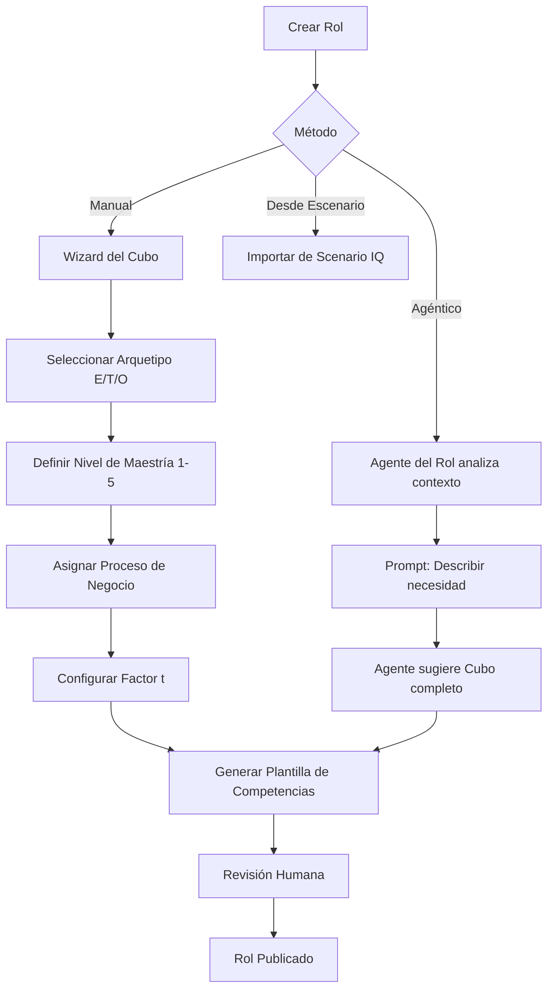
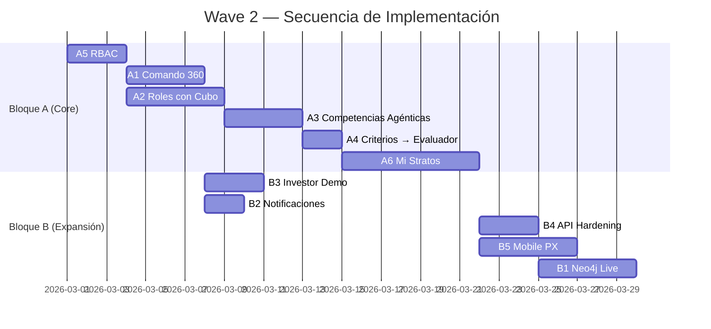

# 🌊 Wave 2 — Plan de Implementación (Marzo 2026)

> **Filosofía:** Wave 2 transforma Stratos de un prototipo técnico a una plataforma productiva con gobernanza, completitud funcional y experiencia de usuario real.

---

## 📋 Inventario Completo (11 items)

### 🔵 Bloque A: Completitud Funcional (Items del creador)

| #   | Feature                                                                                           | Prioridad | Dependencias          |
| :-- | :------------------------------------------------------------------------------------------------ | :-------: | :-------------------- |
| A1  | **Módulo de Comando 360** — Configuración de ciclos de evaluación                                 |  🔴 Alta  | Talento360 existente  |
| A2  | **Creación de Roles con Cubo completo** — Agente del Rol, plantilla, arquetipos                   |  🔴 Alta  | Cubo, Agentes         |
| A3  | **Creación de Competencias Agéntica** — Skills, unidades de aprendizaje, criterios de rendimiento |  🔴 Alta  | AiOrchestratorService |
| A4  | **Clarificación de Criterios de Rendimiento** — Cómo el Evaluador 360 usa criterios BARS          | 🟡 Media  | A3                    |
| A5  | **Módulo de Roles/Permisos (RBAC)** — Control de acceso CRUD                                      |  🔴 Alta  | -                     |
| A6  | **"Mi Stratos" — Portal de Persona** — Experiencia del colaborador completa                       |  🔴 Alta  | A1-A5                 |

### 🟢 Bloque B: Roadmap Original Wave 2

| #   | Feature                                                            | Prioridad | Dependencias        |
| :-- | :----------------------------------------------------------------- | :-------: | :------------------ |
| B1  | **Integración Neo4j Live** — Grafo de Conocimiento real            | 🟡 Media  | Neo4j infra         |
| B2  | **Notificaciones Proactivas** — Slack/Teams desde Culture Sentinel |  🟢 Baja  | CultureSentinel     |
| B3  | **Panel Investor Demo** — Dashboard ejecutivo de impacto           | 🟡 Media  | Métricas existentes |
| B4  | **API Hardening** — Rate limiting, validación, seguridad           | 🟡 Media  | -                   |
| B5  | **Mobile-First PX** — Responsive + micro-interacciones             | 🟡 Media  | A6 (Mi Stratos)     |

---

## 🔵 A1: Módulo de Comando 360

### Propósito

Centro de configuración para el ciclo de evaluación Talento 360. Define **cuándo**, **cómo** y **a quién** se evalúa.

### Configuraciones

```
┌─────────────────────────────────────────────────────────┐
│                   COMANDO 360                           │
├─────────────────────────────────────────────────────────┤
│                                                         │
│  Modalidad de Evaluación:                               │
│  ○ Fecha Específica (ej: 15 de marzo)                   │
│  ○ Trimestral (Q1, Q2, Q3, Q4)                          │
│  ○ Anual (fecha de aniversario del colaborador)         │
│  ○ Continuo Aleatorio (Stratos decide cuándo)           │
│                                                         │
│  Alcance:                                               │
│  ☐ Toda la organización                                 │
│  ☐ Por departamento                                     │
│  ☐ Por escenario estratégico                            │
│  ☐ Solo High Potentials                                 │
│                                                         │
│  Evaluadores:                                           │
│  ☐ Autoevaluación                                       │
│  ☐ Jefe directo                                         │
│  ☐ Pares (cantidad configurable)                        │
│  ☐ Reportes directos                                    │
│  ☐ IA Entrevistadora (Cerbero)                          │
│                                                         │
│  Instrumentos:                                          │
│  ☐ Psicométrico DISC                                    │
│  ☐ Evaluación de Competencias (BARS)                    │
│  ☐ Pulse Survey (sentimiento)                           │
│  ☐ Entrevista IA (chatbot)                              │
│                                                         │
│  Notificaciones:                                        │
│  ☐ Email al colaborador                                 │
│  ☐ Slack/Teams al líder                                 │
│  ☐ Dashboard reminder                                   │
│                                                         │
└─────────────────────────────────────────────────────────┘
```

### Modelo de Datos

```php
// assessment_cycles
Schema::create('assessment_cycles', function (Blueprint $table) {
    $table->id();
    $table->foreignId('organization_id');
    $table->string('name');                    // "Ciclo Q1 2026"
    $table->enum('mode', ['specific_date', 'quarterly', 'annual', 'continuous']);
    $table->json('schedule_config');           // { date: "2026-03-15", quarter: 1, etc }
    $table->json('scope');                     // { type: "all" | "department" | "scenario", ids: [] }
    $table->json('evaluators');                // { self: true, manager: true, peers: 3, reports: true, ai: true }
    $table->json('instruments');               // ["disc", "bars", "pulse", "interview"]
    $table->json('notifications');             // { email: true, slack: false, dashboard: true }
    $table->enum('status', ['draft', 'scheduled', 'active', 'completed']);
    $table->timestamp('starts_at')->nullable();
    $table->timestamp('ends_at')->nullable();
    $table->timestamps();
});
```

### Backend

- `AssessmentCycleController` — CRUD de ciclos
- `AssessmentCycleSchedulerService` — Ejecuta ciclos según configuración
- `AssessmentCycleNotificationService` — Envía notificaciones
- Comando artisan: `assessment:process-cycles` (ejecutar via scheduler)

### Frontend

- Página: `pages/Talento360/Comando.vue`
- Wizard de creación de ciclo (3 pasos: Modalidad → Alcance → Instrumentos)

---

## 🔵 A2: Creación de Roles con Cubo Completo

### Propósito

Completar el flujo de creación de roles usando el modelo del Cubo (Eje X: Arquetipo, Eje Y: Maestría, Eje Z: Proceso, Factor t: Contexto).

### Flujo



### Componentes

- `RoleCubeWizard.vue` — Wizard visual del Cubo con preview 3D
- `RoleAgentService` — Agente que sugiere configuración del Cubo basado en descripción
- `RoleTemplateService` — Genera plantilla de competencias según arquetipo + nivel

---

## 🔵 A3: Creación de Competencias Agéntica

### Propósito

Usar el Agente de Talento para generar competencias completas: definición, skills atómicas, unidades de aprendizaje y **criterios de rendimiento (BARS)**.

### Estructura Generada por el Agente

```json
{
    "competency": {
        "name": "Liderazgo Adaptativo",
        "definition": "Capacidad de...",
        "skills": [
            {
                "name": "Gestión del Cambio",
                "level_descriptors": {
                    "1": "Reconoce la necesidad de cambio",
                    "3": "Lidera iniciativas de cambio",
                    "5": "Diseña estrategias de transformación"
                }
            }
        ],
        "learning_units": [
            {
                "title": "Fundamentos de Cambio Organizacional",
                "type": "course",
                "duration_hours": 8,
                "provider": "internal",
                "target_skill": "Gestión del Cambio",
                "target_level": 3
            }
        ],
        "performance_criteria": [
            {
                "criterion": "Implementa al menos 1 iniciativa de cambio por trimestre",
                "measurement": "count",
                "threshold": 1,
                "period": "quarterly",
                "evidence_type": "observable",
                "bars_anchors": {
                    "1": "No ha iniciado ningún cambio",
                    "3": "Ha implementado 1 cambio con resultados medibles",
                    "5": "Ha liderado 3+ cambios transformacionales con ROI positivo"
                }
            }
        ]
    }
}
```

### Backend

- `CompetencyArchitectService` — Orquesta al Agente de Talento para generar la estructura completa
- Persistencia: `competencies`, `skills`, `learning_units` (nueva tabla), `performance_criteria` (nueva tabla)

---

## 🔵 A4: Criterios de Rendimiento → Evaluador 360

### Propósito

Definir exactamente cómo el **Agente Evaluador 360 (Cerbero)** usa los criterios de rendimiento durante la evaluación.

### Flujo de Uso

```
┌─────────────────────────────────────────────────────────┐
│  Evaluación 360 de "Carlos Mendoza"                     │
│  Rol: Tech Lead (Arquetipo: Táctico, Maestría: 4)       │
│  Competencia: Liderazgo Adaptativo                      │
├─────────────────────────────────────────────────────────┤
│                                                         │
│  CRITERIO: "Implementa al menos 1 iniciativa de cambio  │
│            por trimestre"                                │
│                                                         │
│  BARS Ancla Nivel 1: No ha iniciado ningún cambio       │
│  BARS Ancla Nivel 3: Ha implementado 1 cambio con       │
│                      resultados medibles                │
│  BARS Ancla Nivel 5: Ha liderado 3+ cambios             │
│                      transformacionales con ROI+         │
│                                                         │
│  ──── Evaluación del Agente ────                        │
│                                                         │
│  Cerbero pregunta al Evaluador (jefe/par):              │
│  "¿Cuántas iniciativas de cambio ha liderado Carlos     │
│   en el último trimestre? Describa brevemente."         │
│                                                         │
│  Respuesta: "Lideró la migración a microservicios y     │
│  el rediseño del onboarding técnico."                   │
│                                                         │
│  Cerbero analiza → Score: 4 (entre ancla 3 y 5)         │
│  Rationale: "2 iniciativas superan umbral (1), pero     │
│  no alcanzan nivel 5 (3+ con ROI medido)"               │
│                                                         │
└─────────────────────────────────────────────────────────┘
```

### Impacto en StratosAssessmentService

- El prompt del chatbot recibirá los `performance_criteria` de cada competencia del rol
- Usará las `bars_anchors` como guía para calibrar respuestas
- Generará scores con rationale vinculado a las anclas

---

## 🔵 A5: Módulo de Roles/Permisos (RBAC)

### Propósito

Control de acceso basado en roles para autorizar/denegar operaciones CRUD en toda la plataforma.

### Roles del Sistema

| Rol            | Descripción                      | Acceso                                    |
| :------------- | :------------------------------- | :---------------------------------------- |
| `admin`        | Administrador de la organización | Full CRUD en todo                         |
| `hr_leader`    | Líder de RRHH                    | CRUD en talento, evaluaciones, escenarios |
| `manager`      | Jefe de equipo                   | Read de su equipo, create evaluaciones    |
| `collaborator` | Colaborador                      | Read de su perfil, respond evaluaciones   |
| `observer`     | Observador / Inversionista       | Read-only de dashboards                   |

### Implementación

- Laravel Policies + Gates
- Middleware `can:` en rutas API
- Tabla `role_user` con roles del sistema (no confundir con roles de negocio)
- Componente `v-if="can('edit', 'competencies')"` en frontend

---

## 🔵 A6: "Mi Stratos" — Portal de Persona

### Propósito

Interfaz centrada en el colaborador. Es su espacio personal dentro de Stratos donde ve, interactúa y crece.

### Arquitectura de la Interfaz

```
┌─────────────────────────────────────────────────────────┐
│  MI STRATOS                           Carlos Mendoza    │
│  Tech Lead · Cubo: T4 · Potencial: 85%                 │
├─────────────────┬───────────────────────────────────────┤
│                 │                                       │
│  🏠 Mi Perfil   │  ┌─────────────────────────────────┐  │
│  📊 Mi Rol      │  │  DASHBOARD PERSONAL              │  │
│  🧬 Mi ADN      │  │                                 │  │
│  🎯 Mi Brecha   │  │  Potencial: ████████░░ 85%      │  │
│  📚 Mi Ruta     │  │  Readiness: ██████░░░░ 72%      │  │
│  💬 Mis Convs.  │  │  Learning:  ████░░░░░░ 45%      │  │
│  🏆 Mis Logros  │  │                                 │  │
│  📋 Mis Evals.  │  │  Próximo Hito:                  │  │
│                 │  │  "Completar módulo de ML" (3d)   │  │
│                 │  │                                 │  │
│                 │  │  Escenario Activo:               │  │
│                 │  │  "Expansión LATAM Q2" ▶          │  │
│                 │  │                                 │  │
│                 │  └─────────────────────────────────┘  │
│                 │                                       │
│                 │  ┌─────────────────────────────────┐  │
│                 │  │  CONVERSACIONES ACTIVAS          │  │
│                 │  │                                 │  │
│                 │  │  🤖 Mentor AI — Sesión pendiente │  │
│                 │  │  🫀 Pulse Check — Disponible     │  │
│                 │  │  📋 Eval 360 Q1 — En progreso   │  │
│                 │  └─────────────────────────────────┘  │
│                 │                                       │
└─────────────────┴───────────────────────────────────────┘
```

### Secciones

| Sección                | Contenido                                           | Fuente de Datos                       |
| :--------------------- | :-------------------------------------------------- | :------------------------------------ |
| **Mi Perfil**          | Datos personales, foto, bio                         | `people`                              |
| **Mi Rol**             | Rol actual, arquetipo, Cubo, competencias asignadas | `roles`, `role_competencies`          |
| **Mi ADN**             | Perfil psicométrico, rasgos dominantes, fortalezas  | `psychometric_profiles`               |
| **Mi Brecha**          | Gaps detectados, plan de remediación, prioridades   | `skill_gaps`, `mitigation_plans`      |
| **Mi Ruta**            | Learning path, cursos, avance, próximos hitos       | `learning_paths`, `learning_progress` |
| **Mis Conversaciones** | Mentor AI, Pulse Check, Evaluador 360               | `assessment_sessions`, chatbot        |
| **Mis Logros**         | Badges, milestones, reconocimientos                 | `achievements` (nueva)                |
| **Mis Evaluaciones**   | Resultados 360, histórico, tendencias               | `assessment_results`                  |

### Visión UX

- **Diseño:** Dark mode premium, glassmorphism, micro-animaciones
- **Tono:** Personal, empoderador, no corporativo
- **Gamificación leve:** Progress bars, badges, streaks de aprendizaje
- **Chatbot integrado:** El colaborador puede hablar con su Mentor AI desde aquí

---

## 📅 Secuencia de Implementación Sugerida



### Orden recomendado:

1. **A5 RBAC** (base de seguridad para todo lo demás)
2. **A1 Comando 360** + **A2 Roles con Cubo** (en paralelo)
3. **A3 Competencias Agénticas** → **A4 Criterios de Rendimiento**
4. **A6 Mi Stratos** (requiere A1-A5 como base)
5. **B3 Investor Demo** + **B2 Notificaciones** (quick wins)
6. **B4 API Hardening** → **B5 Mobile PX** → **B1 Neo4j Live**

---

> **Nota:** Este plan integra la visión del creador con el roadmap técnico original. La prioridad es construir la base funcional completa (Bloque A) antes de expandir (Bloque B).
