# 🌊 Wave 2 — Plan de Implementación (Marzo 2026)

> **Filosofía:** Wave 2 transforma Stratos de un prototipo técnico a una plataforma productiva con gobernanza, completitud funcional y experiencia de usuario real.

---

## 📋 Inventario Completo (11 items)

### 🔵 Bloque A: Completitud Funcional (Items del creador)

| #   | Feature                                                                                           | Prioridad | Dependencias          |
| :-- | :------------------------------------------------------------------------------------------------ | :-------: | :-------------------- | ------------------ |
| A1  | **Módulo de Comando 360** — Configuración de ciclos de evaluación                                 |  🔴 Alta  | Talento360 existente  |
| A2  | **Creación de Roles con Cubo completo** — Agente del Rol, plantilla, arquetipos                   |  🔴 Alta  | Cubo, Agentes         |
| A3  | **Creación de Competencias Agéntica** — Skills, unidades de aprendizaje, criterios de rendimiento |  🔴 Alta  | AiOrchestratorService |
| A4  | **Clarificación de Criterios de Rendimiento** — Cómo el Evaluador 360 usa criterios BARS          | 🟡 Media  | A3                    |
| A5  | **Módulo de Roles/Permisos (RBAC)** — Control de acceso CRUD                                      |  🔴 Alta  | -                     | ✅ Implementado    |
| A6  | **"Mi Stratos" — Portal de Persona** — Experiencia del colaborador completa                       |  🔴 Alta  | A1-A5                 | ✅ v1 Implementada |

### 🟢 Bloque B: Roadmap Original Wave 2

| #   | Feature                                                            | Prioridad | Dependencias        |
| :-- | :----------------------------------------------------------------- | :-------: | :------------------ |
| B1  | **Integración Neo4j Live** — Grafo de Conocimiento real            | 🟡 Media  | Neo4j infra         |
| B2  | **Notificaciones Proactivas** — Slack/Teams desde Culture Sentinel |  🟢 Baja  | CultureSentinel     |
| B3  | **Panel Investor Demo** — Dashboard ejecutivo de impacto           | 🟡 Media  | Métricas existentes |
| B4  | **API Hardening** — Rate limiting, validación, seguridad           | 🟡 Media  | -                   |
| B5  | **Mobile-First PX** — Responsive + micro-interacciones             | 🟡 Media  | A6 (Mi Stratos)     |

---

## 🔵 A1: Módulo de Comando 360

### Propósito

Centro de configuración para el ciclo de evaluación Talento 360. Define **cuándo**, **cómo** y **a quién** se evalúa.

### Configuraciones

```
┌─────────────────────────────────────────────────────────┐
│                   COMANDO 360                           │
├─────────────────────────────────────────────────────────┤
│                                                         │
│  Modalidad de Evaluación:                               │
│  ○ Fecha Específica (ej: 15 de marzo)                   │
│  ○ Trimestral (Q1, Q2, Q3, Q4)                          │
│  ○ Anual (fecha de aniversario del colaborador)         │
│  ○ Continuo Aleatorio (Stratos decide cuándo)           │
│                                                         │
│  Alcance:                                               │
│  ☐ Toda la organización                                 │
│  ☐ Por departamento                                     │
│  ☐ Por escenario estratégico                            │
│  ☐ Solo High Potentials                                 │
│                                                         │
│  Evaluadores:                                           │
│  ☐ Autoevaluación                                       │
│  ☐ Jefe directo                                         │
│  ☐ Pares (cantidad configurable)                        │
│  ☐ Reportes directos                                    │
│  ☐ IA Entrevistadora (Cerbero)                          │
│                                                         │
│  Instrumentos:                                          │
│  ☐ Psicométrico DISC                                    │
│  ☐ Evaluación de Competencias (BARS)                    │
│  ☐ Pulse Survey (sentimiento)                           │
│  ☐ Entrevista IA (chatbot)                              │
│                                                         │
│  Notificaciones:                                        │
│  ☐ Email al colaborador                                 │
│  ☐ Slack/Teams al líder                                 │
│  ☐ Dashboard reminder                                   │
│                                                         │
└─────────────────────────────────────────────────────────┘
```

### Modelo de Datos

```php
// assessment_cycles
Schema::create('assessment_cycles', function (Blueprint $table) {
    $table->id();
    $table->foreignId('organization_id');
    $table->string('name');                    // "Ciclo Q1 2026"
    $table->enum('mode', ['specific_date', 'quarterly', 'annual', 'continuous']);
    $table->json('schedule_config');           // { date: "2026-03-15", quarter: 1, etc }
    $table->json('scope');                     // { type: "all" | "department" | "scenario", ids: [] }
    $table->json('evaluators');                // { self: true, manager: true, peers: 3, reports: true, ai: true }
    $table->json('instruments');               // ["disc", "bars", "pulse", "interview"]
    $table->json('notifications');             // { email: true, slack: false, dashboard: true }
    $table->enum('status', ['draft', 'scheduled', 'active', 'completed']);
    $table->timestamp('starts_at')->nullable();
    $table->timestamp('ends_at')->nullable();
    $table->timestamps();
});
```

### Backend

- `AssessmentCycleController` — CRUD de ciclos
- `AssessmentCycleSchedulerService` — Ejecuta ciclos según configuración
- `AssessmentCycleNotificationService` — Envía notificaciones
- Comando artisan: `assessment:process-cycles` (ejecutar via scheduler)

### Frontend

- Página: `pages/Talento360/Comando.vue`
- Wizard de creación de ciclo (3 pasos: Modalidad → Alcance → Instrumentos)

---

## 🔵 A2: Creación de Roles con Cubo Completo

### Propósito

Completar el flujo de creación de roles usando el modelo del Cubo (Eje X: Arquetipo, Eje Y: Maestría, Eje Z: Proceso, Factor t: Contexto).

### Flujo

```mermaid
graph TD
    A[Crear Rol] --> B{Método}
    B -->|Manual| C[Wizard del Cubo]
    B -->|Agéntico| D[Agente del Rol analiza contexto]
    B -->|Desde Escenario| E[Importar de Scenario IQ]

    C --> F[Seleccionar Arquetipo E/T/O]
    F --> G[Definir Nivel de Maestría 1-5]
    G --> H[Asignar Proceso de Negocio]
    H --> I[Configurar Factor t]
    I --> J[Generar Plantilla de Competencias]

    D --> K[Prompt: Describir necesidad]
    K --> L[Agente sugiere Cubo completo]
    L --> J

    J --> M[Revisión Humana]
    M --> N[Rol Publicado]
```



### Componentes

- `RoleCubeWizard.vue` — Wizard visual del Cubo con preview 3D
- `RoleAgentService` — Agente que sugiere configuración del Cubo basado en descripción
- `RoleTemplateService` — Genera plantilla de competencias según arquetipo + nivel

---

## 🔵 A3: Creación de Competencias Agéntica

### Propósito

Usar el Agente de Talento para generar competencias completas: definición, skills atómicas, unidades de aprendizaje y **criterios de rendimiento (BARS)**.

### Estructura Generada por el Agente

```json
{
    "competency": {
        "name": "Liderazgo Adaptativo",
        "definition": "Capacidad de...",
        "skills": [
            {
                "name": "Gestión del Cambio",
                "level_descriptors": {
                    "1": "Reconoce la necesidad de cambio",
                    "3": "Lidera iniciativas de cambio",
                    "5": "Diseña estrategias de transformación"
                }
            }
        ],
        "learning_units": [
            {
                "title": "Fundamentos de Cambio Organizacional",
                "type": "course",
                "duration_hours": 8,
                "provider": "internal",
                "target_skill": "Gestión del Cambio",
                "target_level": 3
            }
        ],
        "performance_criteria": [
            {
                "criterion": "Implementa al menos 1 iniciativa de cambio por trimestre",
                "measurement": "count",
                "threshold": 1,
                "period": "quarterly",
                "evidence_type": "observable",
                "bars_anchors": {
                    "1": "No ha iniciado ningún cambio",
                    "3": "Ha implementado 1 cambio con resultados medibles",
                    "5": "Ha liderado 3+ cambios transformacionales con ROI positivo"
                }
            }
        ]
    }
}
```

### Backend

- `CompetencyArchitectService` — Orquesta al Agente de Talento para generar la estructura completa
- Persistencia: `competencies`, `skills`, `learning_units` (nueva tabla), `performance_criteria` (nueva tabla)

---

## 🔵 A4: Criterios de Rendimiento → Evaluador 360

### Propósito

Definir exactamente cómo el **Agente Evaluador 360 (Cerbero)** usa los criterios de rendimiento durante la evaluación.

### Flujo de Uso

```
┌─────────────────────────────────────────────────────────┐
│  Evaluación 360 de "Carlos Mendoza"                     │
│  Rol: Tech Lead (Arquetipo: Táctico, Maestría: 4)       │
│  Competencia: Liderazgo Adaptativo                      │
├─────────────────────────────────────────────────────────┤
│                                                         │
│  CRITERIO: "Implementa al menos 1 iniciativa de cambio  │
│            por trimestre"                                │
│                                                         │
│  BARS Ancla Nivel 1: No ha iniciado ningún cambio       │
│  BARS Ancla Nivel 3: Ha implementado 1 cambio con       │
│                      resultados medibles                │
│  BARS Ancla Nivel 5: Ha liderado 3+ cambios             │
│                      transformacionales con ROI+         │
│                                                         │
│  ──── Evaluación del Agente ────                        │
│                                                         │
│  Cerbero pregunta al Evaluador (jefe/par):              │
│  "¿Cuántas iniciativas de cambio ha liderado Carlos     │
│   en el último trimestre? Describa brevemente."         │
│                                                         │
│  Respuesta: "Lideró la migración a microservicios y     │
│  el rediseño del onboarding técnico."                   │
│                                                         │
│  Cerbero analiza → Score: 4 (entre ancla 3 y 5)         │
│  Rationale: "2 iniciativas superan umbral (1), pero     │
│  no alcanzan nivel 5 (3+ con ROI medido)"               │
│                                                         │
└─────────────────────────────────────────────────────────┘
```

### Impacto en StratosAssessmentService

- El prompt del chatbot recibirá los `performance_criteria` de cada competencia del rol
- Usará las `bars_anchors` como guía para calibrar respuestas
- Generará scores con rationale vinculado a las anclas

---

## 🔵 A5: Módulo de Roles/Permisos (RBAC) — ✅ IMPLEMENTADO

### Propósito

Control de acceso basado en roles para autorizar/denegar operaciones CRUD en toda la plataforma.

### Estado: ✅ Completado (27-Feb-2026)

### Arquitectura Implementada

```
┌─────────────────────────────────────────────────────────────┐
│                      BACKEND (Laravel 11)                   │
│                                                             │
│  HasSystemRole trait (app/Traits/HasSystemRole.php)          │
│  ├── hasRole(), hasPermission(), can()                       │
│  ├── getPermissions() — cacheado 1h por rol                 │
│  └── isAdmin(), isHrOrAbove()                               │
│                                                             │
│  Middleware (bootstrap/app.php):                            │
│  ├── 'role:admin,hr_leader' → CheckRole.php                 │
│  └── 'permission:scenarios.create' → CheckPermission.php    │
│                                                             │
│  HandleInertiaRequests → comparte role + permissions[]       │
│                                                             │
│  RBACController → GET/POST /api/rbac (admin only)           │
├─────────────────────────────────────────────────────────────┤
│                      FRONTEND (Vue 3)                       │
│                                                             │
│  usePermissions() composable (Singleton reactivo)            │
│  ├── can('scenarios.create') → bool                         │
│  ├── canModule('scenarios') → bool                          │
│  ├── hasRole('admin', 'hr_leader') → bool                   │
│  └── isAtLeast('manager') → bool (jerarquía)                │
│                                                             │
│  AppSidebar.vue → filtra NavItems por requiredPermission     │
│  settings/RBAC.vue → UI admin para gestión de permisos       │
└─────────────────────────────────────────────────────────────┘
```

### Roles del Sistema (5 niveles)

| Rol            | Identificador  | Permisos | Acceso                                    |
| :------------- | :------------- | :------: | :---------------------------------------- |
| `admin`        | Administrador  |    18    | Full CRUD en todo                         |
| `hr_leader`    | Líder RRHH     |    13    | CRUD en talento, evaluaciones, escenarios |
| `manager`      | Jefe de equipo |    8     | Read equipo, create evaluaciones          |
| `collaborator` | Colaborador    |    2     | Mi Stratos, respond evaluaciones          |
| `observer`     | Observador     |    3     | Read-only dashboards                      |

### Implementación Detallada

- **Migración:** `2026_02_27_014700_create_rbac_tables.php` — tablas `permissions` + `role_permissions`
- **Seeder:** `RolePermissionSeeder.php` — 18 permisos, 45 mappings
- **Middleware:** `CheckRole`, `CheckPermission` — registrados en bootstrap/app.php
- **Inertia:** Permisos compartidos vía `HandleInertiaRequests` (instantáneo, sin API call)
- **Composable:** `usePermissions.ts` — lee de Inertia o API fallback
- **Sidebar:** `AppSidebar.vue` — items con `requiredPermission` / `requiredRole`
- **UI Admin:** `settings/RBAC.vue` — gestión visual de la matriz de permisos

> 📖 Documentación completa: [`docs/Architecture/RBAC_SYSTEM.md`](./Architecture/RBAC_SYSTEM.md)

---

## 🔵 A6: "Mi Stratos" — Portal de Persona — ✅ v1 IMPLEMENTADA

### Propósito

Interfaz centrada en el colaborador. Es su espacio personal dentro de Stratos donde ve, interactúa y crece.

### Estado: ✅ v1 Implementada (27-Feb-2026)

### Arquitectura Implementada

```
┌─────────────────────────────────────────────────────────────┐
│  BACKEND                                                    │
│  MiStratosController.php → GET /api/mi-stratos/dashboard    │
│  ├── Carga People con relaciones (role, skills, dept, etc.) │
│  ├── Calcula Gap Analysis vía GapAnalysisService            │
│  ├── Agrega Learning Paths con progreso                     │
│  ├── Lista Assessment Sessions activas                      │
│  └── Calcula KPIs: Potencial, Readiness, Learning, Skills   │
├─────────────────────────────────────────────────────────────┤
│  FRONTEND: pages/MiStratos/Index.vue                        │
│  ├── Hero Header (avatar, rol, cubo, arquetipo, KPI match)  │
│  ├── Mini Sidebar con 5 secciones                           │
│  ├── Dashboard: 4 KPI cards + paneles resumen               │
│  ├── Mi Rol: competencias con barras de progreso por skill  │
│  ├── Mi Brecha: gap analysis visual con brechas detectadas  │
│  ├── Mi Ruta: learning paths con % de avance                │
│  └── Conversaciones: sesiones de evaluación activas         │
└─────────────────────────────────────────────────────────────┘
```

### Diseño Visual

- **Background:** Gradiente profundo `#0f0c29 → #1a1a3e → #24243e`
- **Cards:** Glassmorphism con `backdrop-filter: blur(12px)` y bordes semitransparentes
- **KPIs:** Colores de estado dinámicos (verde ≥80%, naranja ≥60%, rojo <40%)
- **Animaciones:** Hover scale en avatar, translateY en cards, transiciones fade entre secciones
- **Responsive:** Sidebar se convierte en tabs horizontales en mobile

### Secciones Implementadas (v1)

| Sección       | Contenido                                | Fuente de Datos            | Estado |
| :------------ | :--------------------------------------- | :------------------------- | :----: |
| **Dashboard** | 4 KPI cards + paneles de resumen         | KPIs calculados, agregados |   ✅   |
| **Mi Rol**    | Competencias con barras skill-by-skill   | `roles`, `role_skills`     |   ✅   |
| **Mi Brecha** | Gap analysis con match % y lista de gaps | `GapAnalysisService`       |   ✅   |
| **Mi Ruta**   | Learning paths con progreso y acciones   | `development_paths`        |   ✅   |
| **Convs.**    | Sesiones activas de evaluación/mentor    | `assessment_sessions`      |   ✅   |

### Secciones Planeadas (v2)

| Sección              | Contenido                               | Estado |
| :------------------- | :-------------------------------------- | :----: |
| **Mi ADN**           | Perfil psicométrico, rasgos, fortalezas |   ⏳   |
| **Mis Logros**       | Badges, milestones, gamificación        |   ⏳   |
| **Mis Evaluaciones** | Resultados 360, histórico, tendencias   |   ⏳   |
| **Chatbot**          | Mentor AI integrado in-page             |   ⏳   |

### Archivos

| Archivo                                            | Propósito                                           |
| -------------------------------------------------- | --------------------------------------------------- |
| `app/Http/Controllers/Api/MiStratosController.php` | Backend — agrega toda la data del usuario           |
| `resources/js/pages/MiStratos/Index.vue`           | Frontend — portal premium con glassmorphism         |
| `routes/web.php`                                   | Ruta `/mi-stratos` (auth, verified)                 |
| `routes/api.php`                                   | Endpoint `/api/mi-stratos/dashboard` (auth:sanctum) |

---

## 📅 Secuencia de Implementación Sugerida


### Orden recomendado:

1. **A5 RBAC** (base de seguridad para todo lo demás)
2. **A1 Comando 360** + **A2 Roles con Cubo** (en paralelo)
3. **A3 Competencias Agénticas** → **A4 Criterios de Rendimiento**
4. **A6 Mi Stratos** (requiere A1-A5 como base)
5. **B3 Investor Demo** + **B2 Notificaciones** (quick wins)
6. **B4 API Hardening** → **B5 Mobile PX** → **B1 Neo4j Live**

---

> **Nota:** Este plan integra la visión del creador con el roadmap técnico original. La prioridad es construir la base funcional completa (Bloque A) antes de expandir (Bloque B).
