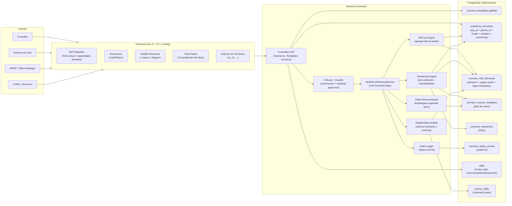
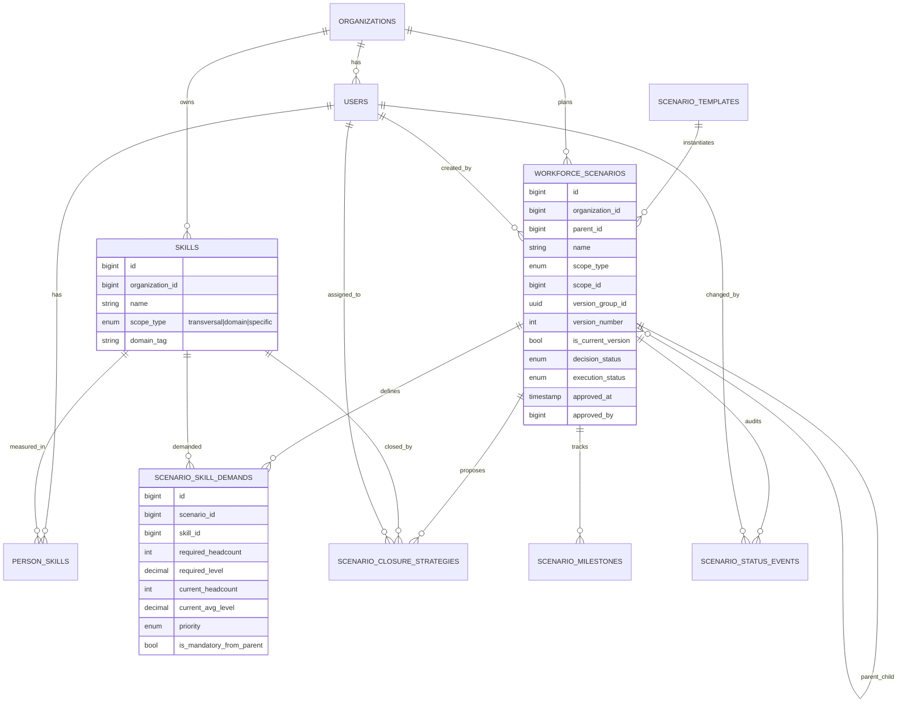
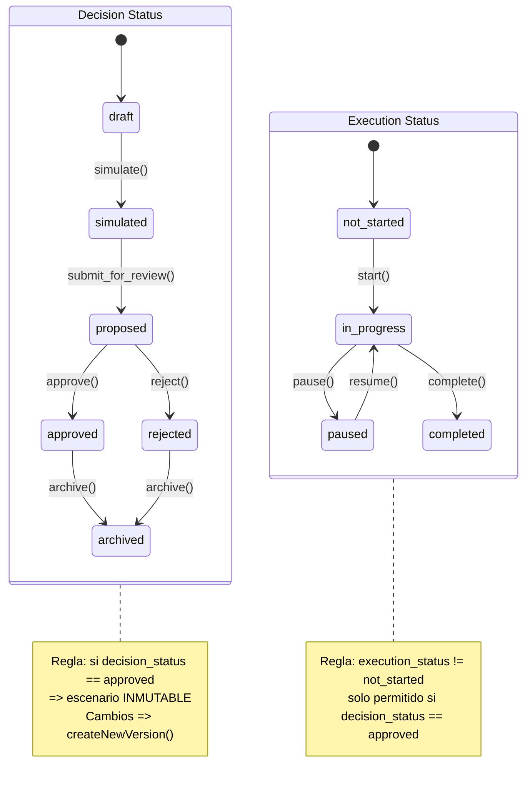
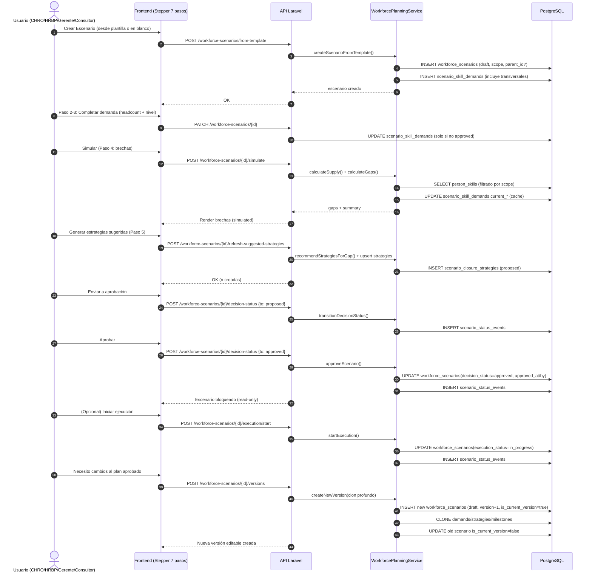

### Diagrama(s) para documentar el módulo **Workforce Planning (WFP)** + **Modelamiento de Escenarios** (TalentIA)

A continuación tienes un set de diagramas (en **Mermaid**) para documentación: **qué hace**, **cómo se usa**, **componentes**, **elementos principales** y **cómo funciona** (workflow + estados + versionamiento). Puedes pegarlos en tu README, Wiki, Notion o cualquier soporte que renderice Mermaid.

#### 1) Vista de arquitectura (componentes y responsabilidades)

**Lectura rápida:**  
- **WFP Baseline** vive como “foto actual” (skills reales desde `person_skills`).  
- **Escenarios** son una capa proyectiva encima: demandan skills futuras, calculan gaps, proponen estrategias, se aprueban y (si se ejecutan) se monitorean.  
- **Approved = inmutable** → cambios se hacen mediante **nueva versión**.

#### 2) Modelo de dominio (entidades y relaciones principales)

**Qué representa:**
- Un **escenario** puede ser **padre** (corporativo) y tener **hijos** (por área).  
- Las **skills** NO se organizan en árbol; se clasifican por alcance (`transversal/domain/specific`).  
- La demanda se define en `scenario_skill_demands`, y el supply se calcula desde `person_skills` (y se puede cachear).

#### 3) Máquina de estados (decisión vs ejecución + reglas clave)

**Idea central:**  
- `simulated` = “what-if con cálculos”, no implica plan en marcha.  
- `approved` = “plan oficial”, queda **bloqueado**.  
- La ejecución (start/pause/complete) solo existe si está `approved`.

#### 4) Flujo de uso (cómo se usa y cómo “lo hace”)

---

### Cómo explicar “qué hace” y “cómo lo hace” (texto para documentación)

#### Qué hace
- Permite **planificar el talento futuro** mediante **escenarios** (what-if → plan aprobado → ejecución), en lugar de solo describir el presente.  
- Soporta **escenarios globales** y **escenarios por área/familia de roles**, y permite **consolidación** (roll-up) cuando existe un escenario padre.  
- Mantiene trazabilidad: lo aprobado queda **inmutable** y los cambios se hacen con **versiones**.

#### Cómo lo hace (mecánica interna)
- **Supply (inventario)**: se calcula desde `person_skills`, filtrando por el **scope** del escenario.  
- **Demand (futuro)**: se define en `scenario_skill_demands` (headcount requerido + nivel requerido).  
- **Gaps**: se calcula `gap_headcount` y `gap_level` comparando supply vs demand.  
- **Estrategias**: se proponen/capturan en `scenario_closure_strategies` (build/buy/borrow/bridge/bind/bot).  
- **Estados**: separa “decisión” (draft→simulated→proposed→approved) de “ejecución” (not_started→in_progress→paused→completed).  
- **Versionamiento**: al aprobar, el escenario se bloquea; si se requiere ajuste, se crea una nueva versión con clon profundo (demands/strategies/milestones).

---

Si quieres, puedo adaptar estos diagramas a tu nomenclatura real (por ejemplo si usas `employees` en vez de `users`, `org_units` en vez de `departments`, o si ya existe `role_families`). Solo dime cómo se llaman esas entidades en tu modelo actual.