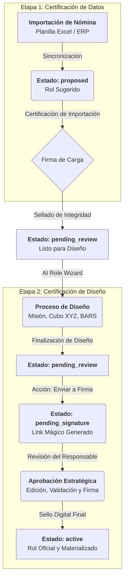

# Especificación Detallada: Ciclo de Vida y Certificación Dual de Roles

Este documento proporciona una guía técnica y conceptual exhaustiva del flujo de vida de un Rol en Stratos, desde su origen en la importación de datos hasta su oficialización mediante firma digital estratégica.

---

## 1. Arquitectura del Macro-proceso

El flujo de Stratos se divide en dos grandes etapas de certificación para garantizar la integridad de los datos y la calidad del diseño organizacional.

---

## 2. Detalle Paso a Paso

### Paso 1: Importación Masiva y Creación de Nodos Gravitacionales
- **Origen:** Los datos provienen de la planilla de personal (Nómina).
- **Lógica Técnica:** El `BulkPeopleImportController` identifica nuevos departamentos y los registra como **Nodos Gravitacionales** (Anclas de identidatd en el Grafo).
- **Sincronización:** Cada Rol importado es "atraído" y anclado a su respectivo Nodo Gravitacional (Departamento), asegurando la coherencia estructural desde el primer segundo.
- **Estado Inicial del Rol:** `proposed`.
- **Certificación:** El administrador que realiza la importación firma el proceso. Esta firma certifica la **Existencia Administrativa** y la validez de los Nodos Gravitacionales creados, pero no valida el diseño estratégico del rol.
- **Resultado:** El rol aparece vinculado a su ancla organizacional con el badge **"En Proceso"**.

### Paso 2: Diseño Estratégico (Wizard de 5 Pasos)
- **Actor:** Arquitecto de Talento / Consultor.
- **Herramienta:** `RoleCubeWizard.vue`.
- **Acciones:**
    - Definición de Misión y Propósito.
    - Mapeo en el Cubo de Coordenadas XYZ (Arquetipo, Maestría, Proceso).
    - Selección de Competencias Core (SFIA 8).
    - Definición de Estándares BARS (Conducta, Actitud, Responsabilidad, Habilidad).
- **Finalización:** Al completar el wizard, el sistema guarda la configuración técnica y mantiene el estado en `pending_review`.
- **Badge:** **"Por Confirmar"**.

### Paso 3: Solicitud de Aprobación y Link Mágico
- **Acción UI:** En la tabla de roles, se activa el icono de **Avión de Papel (`PhPaperPlaneTilt`)**.
- **Proceso:** El arquitecto selecciona al líder responsable (CHRO, Gerente de Área, etc.).
- **Lógica Técnica:**
    - Se genera un registro en la tabla `approval_requests` con un `token` único UUID.
    - El sistema genera un **Enlace Mágico** (`/approve/role/{token}`).
    - El estado del rol cambia a **`pending_signature`**.
- **Gestión de Entrega:** La UI facilita la copia del enlace para su envío por canales externos (WhatsApp, Slack, Email) mientras se automatizan las notificaciones.
- **Seguridad:** El rol queda bloqueado para ediciones directas fuera del flujo de aprobación.
- **Badge:** **"En Firma"**.

### Paso 4: Revisión y Firma Estratégica
- **Actor:** Líder Responsable / Stakeholder.
- **Interfaz:** Componente `Approval.vue` (Acceso vía Magic Link).
- **Funcionalidades:**
    - El responsable puede **editar** la misión, el propósito y los resultados esperados para ajustarlos a la realidad del negocio.
    - Visualización detallada de competencias y niveles propuestos.
- **Firma Digital:** Al presionar "Aprobar y Firmar", el sistema genera un sello digital (Hash HMAC) que vincula el contenido del rol con la identidad del firmante y la marca de tiempo (`signed_at`).
- **Materialización Automática:** El sistema activa todas las competencias y habilidades vinculadas al rol, moviéndolas de `proposed` a `active` en el catálogo.

### Paso 5: Estado Final y Auditoría
- **Estado Final:** `active`.
- **Badge:** **"Aprobada"**.
- **ISO 9001/27001:** Se genera una entrada inmutable en el log de auditoría. El rol ya es utilizable para evaluaciones de desempeño, planes de desarrollo y análisis de brechas de IA.

---

## 3. Matriz de Estados y Responsabilidades

| Estado | Significado Conceptual | Acción Requerida | Responsable |
| :--- | :--- | :--- | :--- |
| **`proposed`** | El rol existe técnicamente (nómina). | Completar diseño en Wizard. | Arquitecto de Talento |
| **`pending_review`** | Diseño técnico completado. | Enviar a revisión superior. | Arquitecto de Talento |
| **`pending_signature`** | Esperando validación estratégica. | Revisar y Firmar Digitalmente. | Líder / Stakeholder |
| **`active`** | Rol oficializado y certificado. | Ninguna (Uso operativo). | Sistema |

---

## 4. Notas Técnicas Complementarias

- **Polimorfismo:** El sistema utiliza el mismo motor de aprobación para Roles y Competencias independientes, diferenciando la lógica de materialización mediante el campo `approvable_type`.
- **Resiliencia de Firma:** Si se intenta modificar un rol `active` sin un nuevo flujo de aprobación, el sistema detecta la rotura del sello digital y marca el registro como "No Íntegro" en auditoría.
- **Reenvío de Solicitudes:** Si un líder no ha firmado, el administrador puede usar el icono de **Sello (`PhSealCheck`)** en la tabla para reenviar el enlace o actualizar el responsable de la firma.

---
> [!IMPORTANT]
> **Diferenciación Clave:** La firma en la etapa de **Importación** valida la *Existencia Administrativa*. La firma en la etapa de **Aprobación** valida la *Definición Estratégica*.
