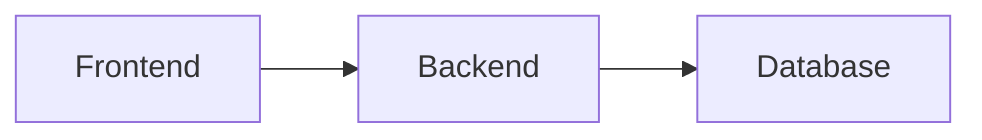

# Strato Wiki

Documentación técnica de Strato usando MkDocs Material.

---

## 🚀 Quick Start

### Instalar Dependencias

```bash
cd docs_wiki
pip install -r requirements.txt
```

### Preview Local

```bash
mkdocs serve
```

Abre http://127.0.0.1:8000 en tu navegador.

---

## 📁 Estructura

```
docs_wiki/
├── mkdocs.yml              # Configuración principal
├── requirements.txt        # Dependencias Python
├── docs/                   # Contenido de la wiki
│   ├── index.md           # Página principal
│   ├── getting-started/
│   │   ├── quick-start.md
│   │   └── installation.md
│   ├── development/
│   │   ├── crud-pattern.md
│   │   ├── new-crud-guide.md
│   │   └── ...
│   ├── architecture/
│   │   ├── overview.md
│   │   └── ...
│   └── api/
│       ├── endpoints.md
│       └── ...
└── site/                   # Build output (gitignored)
```

---

## 📝 Agregar Contenido

### Crear Nueva Página

```bash
# Crear archivo
touch docs/nueva-seccion/nueva-pagina.md

# Editar contenido
cat > docs/nueva-seccion/nueva-pagina.md << 'EOF'
# Título de la Página

Contenido aquí...
EOF
```

### Agregar a Navegación

Edita `mkdocs.yml`:

```yaml
nav:
  - Tu Sección:
    - Nueva Página: nueva-seccion/nueva-pagina.md
```

---

## 🎨 Características de MkDocs Material

### Admonitions (Cajas de Nota)

```markdown
!!! note "Título Opcional"
    Contenido de la nota.

!!! warning "Advertencia"
    Esto es importante.

!!! tip "Consejo"
    Usa esto para mejores resultados.

!!! danger "Peligro"
    ¡Cuidado con esto!
```

### Tabs

```markdown
=== "Tab 1"
    Contenido del tab 1.

=== "Tab 2"
    Contenido del tab 2.
```

### Code Blocks con Highlighting

````markdown
```python
def hello():
    print("Hello World")
```

```typescript
const greeting: string = "Hello";
```
````

### Diagramas Mermaid

````markdown

````

---

## 🚀 Build para Producción

### Generar Sitio Estático

```bash
mkdocs build
```

Output en `site/`.

### Deploy a GitHub Pages

```bash
mkdocs gh-deploy
```

Esto:
1. Construye el sitio
2. Publica a rama `gh-pages`
3. Tu wiki estará en `https://yourusername.github.io/Strato/`

---

## ⚙️ Configuración Avanzada

### Personalizar Tema

Edita `mkdocs.yml`:

```yaml
theme:
  name: material
  palette:
    primary: blue
    accent: amber
  features:
    - navigation.instant
    - navigation.tabs
```

### Agregar Plugins

```yaml
plugins:
  - search
  - git-revision-date-localized
```

### Custom CSS

1. Crea `docs/stylesheets/extra.css`
2. Agrega en `mkdocs.yml`:

```yaml
extra_css:
  - stylesheets/extra.css
```

---

## 🔄 Workflow de Contribución

### 1. Editar Contenido

```bash
# Edita el archivo MD
vim docs/development/crud-pattern.md
```

### 2. Preview Cambios

```bash
mkdocs serve
# → http://127.0.0.1:8000
```

### 3. Commit

```bash
git add docs_wiki/
git commit -m "docs: actualizar guía de CRUD pattern"
git push
```

### 4. Deploy (opcional)

```bash
mkdocs gh-deploy
```

---

## 📚 Recursos

- **[MkDocs Documentation](https://www.mkdocs.org/)**
- **[Material for MkDocs](https://squidfunk.github.io/mkdocs-material/)**
- **[Markdown Guide](https://www.markdownguide.org/)**

---

## 🎯 Próximos Pasos

### Páginas Pendientes

Estas páginas necesitan ser creadas (puedes copiar contenido de `/docs`):

- [ ] `getting-started/installation.md`
- [ ] `development/new-crud-guide.md`
- [ ] `development/formschema-system.md`
- [ ] `development/testing.md`
- [ ] `development/commits.md`
- [ ] `architecture/frontend.md`
- [ ] `architecture/backend.md`
- [ ] `architecture/database.md`
- [ ] `architecture/request-flow.md`
- [ ] `api/authentication.md`
- [ ] `api/errors.md`
- [ ] `modules/*.md` (4 módulos)
- [ ] `setup/*.md` (3 archivos)

### Cómo Agregar Páginas Faltantes

**Opción 1: Copiar manualmente**

```bash
# Ejemplo: authentication.md
cp docs/AUTH_SANCTUM_COMPLETA.md docs_wiki/docs/api/authentication.md
# Editar y adaptar formato
```

**Opción 2: Consolidar varios docs**

Para páginas que combinan múltiples documentos (ej: `new-crud-guide.md`):

1. Lee `GUIA_CREAR_NUEVO_CRUD_GENERICO.md` + `CHECKLIST_NUEVO_CRUD.md`
2. Crea `docs_wiki/docs/development/new-crud-guide.md`
3. Consolida en una guía única

---

## 💬 Soporte

Preguntas sobre la wiki:
- Lee la [documentación de MkDocs Material](https://squidfunk.github.io/mkdocs-material/)
- Revisa ejemplos en páginas ya creadas

---

**Última actualización:** 5 Enero 2026
