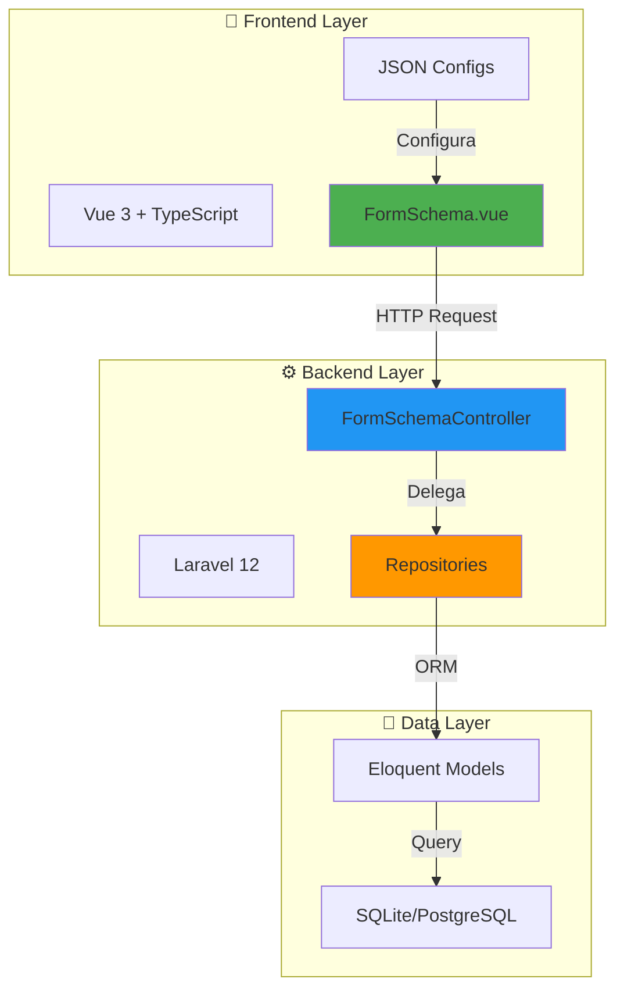
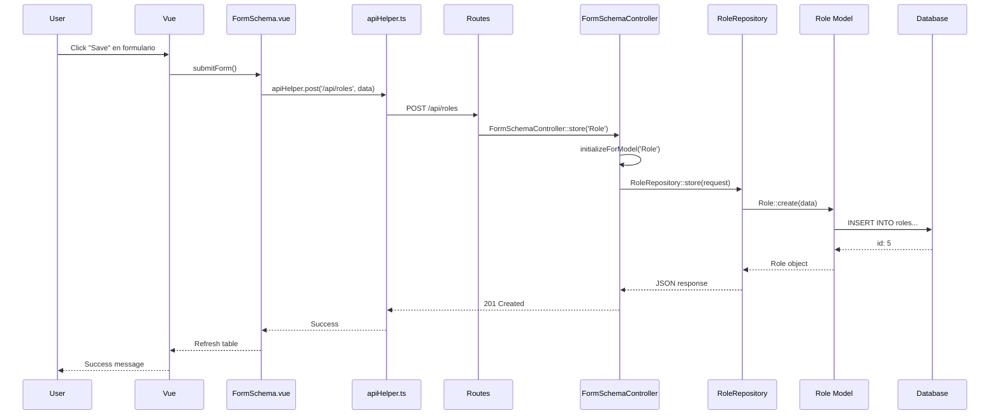

# Architecture Overview

Entiende cómo Strato está diseñado y cómo fluyen los datos a través del sistema.

---

## 📊 Vista de 10,000 Pies

Strato usa una **arquitectura en 3 capas** con patrón **JSON-Driven**:



---

## 🎯 Calificación General: **8.5/10**

Tu arquitectura está **lista para producción** con algunos ajustes de seguridad.

| Componente | Score | Estado |
|------------|-------|--------|
| **Frontend** | 8.4/10 | ✅ Excelente |
| **Backend** | 9.0/10 | ✅ Robusto |
| **Testing** | 8.0/10 | ✅ Auto-generado |
| **Seguridad** | 7.0/10 | ⚠️ Mejorar |
| **Performance** | 7.5/10 | ⚠️ Optimizar |

---

## 🏗️ Capas de la Arquitectura

### Capa 1: Frontend (Vue 3)

```
┌──────────────────────────────────────────┐
│  Pages (Orquestadores)                   │
│  ├─ People/Index.vue                     │
│  ├─ Roles/Index.vue                      │
│  └─ Skills/Index.vue                     │
│      ↓ Importan JSON                     │
├──────────────────────────────────────────┤
│  Configuración (JSON)                    │
│  ├─ config.json         (endpoints)      │
│  ├─ tableConfig.json    (columnas)       │
│  ├─ itemForm.json       (formulario)     │
│  └─ filters.json        (búsqueda)       │
│      ↓ Props                             │
├──────────────────────────────────────────┤
│  Componentes Genéricos                   │
│  ├─ FormSchema.vue  (CRUD Logic) 9/10    │
│  ├─ FormData.vue    (Form Render) 7/10   │
│  └─ FormTable.vue   (Table Display)      │
│      ↓ HTTP                              │
├──────────────────────────────────────────┤
│  API Layer                               │
│  └─ apiHelper.ts    (Axios wrapper) 9/10 │
└──────────────────────────────────────────┘
```

**Fortalezas:**
- ✅ Reutilización 96%
- ✅ Configuración declarativa
- ✅ TypeScript type-safe
- ✅ Composables bien estructurados

**Debilidades:**
- ⚠️ FormData.vue incompleto
- ⚠️ Sin validación client-side robusta
- ⚠️ Debugging logs dispersos

### Capa 2: Backend (Laravel 12)

```
┌──────────────────────────────────────────┐
│  Routes (Auto-generadas)                 │
│  form-schema-complete.php                │
│  ├─ Mapeo: 'People' => 'people'          │
│  └─ Genera 6 rutas × 80 modelos          │
│      ↓                                   │
├──────────────────────────────────────────┤
│  Controller Genérico                     │
│  FormSchemaController  9/10              │
│  ├─ initializeForModel($modelName)       │
│  ├─ index(), store(), show()             │
│  ├─ update(), destroy()                  │
│  └─ search()                             │
│      ↓ Delega                            │
├──────────────────────────────────────────┤
│  Repositories (Business Logic)           │
│  ├─ PeopleRepository                     │
│  ├─ RoleRepository                       │
│  └─ SkillRepository                      │
│      ↓ Query                             │
├──────────────────────────────────────────┤
│  Eloquent Models (ORM)                   │
│  ├─ People.php                           │
│  ├─ Role.php                             │
│  └─ Skill.php                            │
└──────────────────────────────────────────┘
```

**Fortalezas:**
- ✅ Repository Pattern implementado
- ✅ 1 controller para 80+ modelos
- ✅ Rutas dinámicas
- ✅ Eloquent relationships bien definidas

**Debilidades:**
- ⚠️ Sin validation rules
- ⚠️ Sin authorization policies
- ⚠️ Paginación no configurada en todos los repos

### Capa 3: Data (Base de Datos)

```
┌──────────────────────────────────────────┐
│  Database (SQLite dev / PostgreSQL prod) │
│                                          │
│  ┌─────────────┐    ┌──────────────┐    │
│  │   people    │    │    roles     │    │
│  ├─────────────┤    ├──────────────┤    │
│  │ id          │    │ id           │    │
│  │ name        │    │ name         │    │
│  │ email       │    │ description  │    │
│  └─────────────┘    └──────────────┘    │
│         │                    │          │
│         └────────┬───────────┘          │
│                  │                      │
│         ┌────────▼────────┐             │
│         │  people_roles   │             │
│         ├─────────────────┤             │
│         │ person_id       │             │
│         │ role_id         │             │
│         │ level           │             │
│         └─────────────────┘             │
└──────────────────────────────────────────┘
```

**Fortalezas:**
- ✅ Migraciones versionadas
- ✅ Relaciones many-to-many bien definidas
- ✅ Seeders completos

**Debilidades:**
- ⚠️ Sin índices en columnas frecuentes
- ⚠️ Sin audit trail

---

## 🔄 Flujo de una Petición Completa

### Ejemplo: Crear un Role



**Tiempo típico:** ~200ms (desarrollo), ~100ms (producción optimizada)

---

## 🎨 Decisiones de Arquitectura Clave

### 1. **¿Por qué JSON-Driven?**

**Alternativas consideradas:**
- ❌ Código Vue duplicado por módulo
- ❌ Generación de código con CLI
- ✅ **Configuración JSON + componente genérico**

**Razón:** Cambiar comportamiento sin rebuild, testing más fácil.

### 2. **¿Por qué 1 FormSchemaController en lugar de N controllers?**

**Alternativas consideradas:**
- ❌ Controller por modelo (80 controllers)
- ❌ Traits compartidos (complejidad media)
- ✅ **1 controller genérico dinámico**

**Razón:** 96% menos código, mantenimiento centralizado.

### 3. **¿Por qué Repository Pattern?**

**Alternativas consideradas:**
- ❌ Queries directas en controller
- ❌ Services + controllers
- ✅ **Repositories + controller genérico**

**Razón:** Separación de concerns, testing más fácil.

---

## 🔴 3 Acciones Críticas Antes de Producción

### 1. **Input Validation** (2 horas)

```php
// FormSchemaController.php
public function store(Request $request, string $modelName)
{
    // AGREGAR:
    $validated = $request->validate([
        'name' => 'required|string|max:255',
        'email' => 'required|email|unique:people',
    ]);
    
    return $this->repository->store($validated);
}
```

### 2. **Authorization** (3 horas)

```php
// Crear Policy
php artisan make:policy RolePolicy --model=Role

// Aplicar en controller
public function update(Request $request, string $modelName, $id)
{
    $this->authorize('update', $this->model);
    return $this->repository->update($request, $id);
}
```

### 3. **XSRF Protection Testing** (1 hora)

```php
// Verificar en tests
public function test_create_role_requires_csrf_token()
{
    $response = $this->postJson('/api/roles', [...]);
    $response->assertStatus(419); // CSRF token mismatch
}
```

---

## 📈 Escalabilidad

### Agregar Nuevo Módulo (15 min)

**Pasos:**

1. Registrar en `form-schema-complete.php` (1 min)
2. Crear 4 JSONs de configuración (8 min)
3. Crear `Index.vue` orquestador (3 min)
4. Agregar ruta en Vue Router (2 min)
5. Verificar (1 min)

**Total:** 15 minutos → CRUD completo funcionando

### Cargar 10,000+ Registros

**Optimizaciones necesarias:**

```php
// Repository
public function index(Request $request)
{
    return $this->model
        ->select(['id', 'name', 'email']) // Limitar columnas
        ->with('roles:id,name')           // Eager loading
        ->paginate(50);                   // Paginación
}
```

**Índices recomendados:**

```php
// Migration
$table->index('email');
$table->index('department_id');
$table->index(['created_at', 'status']);
```

---

## 🔐 Consideraciones de Seguridad

| Riesgo | Mitigación | Estado |
|--------|-----------|--------|
| **SQL Injection** | Eloquent ORM | ✅ Protegido |
| **XSS** | Vue auto-escaping | ✅ Protegido |
| **CSRF** | Sanctum tokens | ✅ Implementado |
| **Mass Assignment** | $fillable en models | ✅ Protegido |
| **Authz bypass** | Policies | ⚠️ Falta implementar |
| **Input validation** | Validation rules | ⚠️ Falta implementar |

---

## 📚 Próximos Pasos

<div class="grid" markdown>

- **[Frontend Details →](frontend.md)**
  
  Profundiza en componentes Vue y helpers.

- **[Backend Details →](backend.md)**
  
  Entiende FormSchemaController y Repositories.

- **[Database Design →](database.md)**
  
  Diagrama ER y relaciones.

- **[Request Flow →](request-flow.md)**
  
  Flujo detallado paso a paso.

</div>
