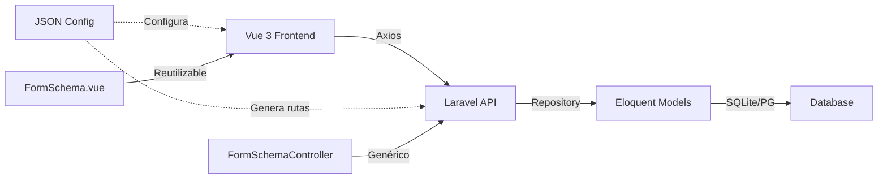

# Bienvenido a Strato

<div class="grid cards" markdown>

- :rocket: **[Quick Start →](getting-started/quick-start.md)**

    Comienza en 5 minutos. Instalación rápida y tu primer CRUD.

- :books: **[CRUD Pattern →](development/crud-pattern.md)**

    Aprende el patrón JSON-Driven que revoluciona el desarrollo CRUD.

- :material-code-json: **[API Reference →](api/endpoints.md)**

    17 endpoints documentados del MVP con ejemplos de uso.

- :material-graph: **[Arquitectura →](architecture/overview.md)**

    Entiende cómo funciona todo el sistema de punta a punta.

</div>

---

## 🎯 ¿Qué es Strato?

**Strato** es un sistema ATS (Applicant Tracking System) de próxima generación que combina:

- **Gestión de talento inteligente** con análisis de brechas de competencias
- **Matching automático** de candidatos a vacantes usando algoritmos avanzados
- **Planes de desarrollo personalizados** basados en análisis de gaps
- **Arquitectura moderna** con Laravel 12, Vue 3 y patrón JSON-Driven CRUD

---

## ⚡ Características Principales

### 🔥 JSON-Driven CRUD Pattern

Crea módulos CRUD completos en **10 minutos** sin duplicar código:

```json
// Solo necesitas este JSON
{
  "titulo": "People",
  "endpoint": "people",
  "fields": [...]
}
```

**Un solo componente** reutilizable genera toda la UI y lógica CRUD.

### 🎨 Frontend Moderno

- **Vue 3** + Composition API + TypeScript
- **Vuetify 3** para UI components
- **Axios** con interceptores centralizados
- **Vite** para dev server ultra-rápido

### 🚀 Backend Robusto

- **Laravel 12** + PHP 8.4
- **FormSchemaController genérico** (1 controller para 80+ modelos)
- **Repository Pattern** con inyección de dependencias
- **SQLite** en desarrollo, **PostgreSQL** en producción

### 🧪 Testing Automático

```bash
php artisan make:form-schema-test People --model
# Genera tests completos automáticamente
```

---

## 📊 Módulos del Sistema

### Core Modules

| Módulo | Descripción | Estado |
|--------|-------------|--------|
| **People** | Gestión de personas y perfiles | ✅ Completo |
| **Roles** | Catálogo de roles organizacionales | ✅ Completo |
| **Skills** | Gestión de competencias | ✅ Completo |
| **Gap Analysis** | Análisis de brechas de competencias | ✅ Completo |
| **Learning Paths** | Planes de desarrollo personalizados | ✅ Completo |
| **Marketplace** | Matching de candidatos a vacantes | ✅ Completo |

### Workforce Planning (En desarrollo)

| Módulo | Descripción | Estado |
|--------|-------------|--------|
| **Strategic Roles** | Roles estratégicos de la organización | 🔨 En desarrollo |
| **People Availability** | Disponibilidad de personas por período | 🔨 En desarrollo |
| **Demand Forecast** | Proyección de demanda de talento | 🔨 En desarrollo |

---

## 🏗️ Arquitectura en 30 Segundos



**Flujo típico:**

1. `People/Index.vue` carga `people-table-config.json`
2. `FormSchema.vue` genera UI y lógica CRUD automáticamente
3. Peticiones van a `/api/people` → `FormSchemaController`
4. Controller inicializa dinámicamente `PeopleRepository`
5. Repository ejecuta queries y retorna JSON

**Resultado:** Sin duplicar código, CRUD completo funcionando.

---

## 🚀 Próximos Pasos

<div class="grid cards" markdown>

- :material-clock-fast: **5 minutos**
  
    **[Instalación rápida →](getting-started/quick-start.md)**
    
    Clona el repo, instala dependencias y levanta el servidor.

- :material-book-open-variant: **15 minutos**
  
    **[Tu primer CRUD →](development/new-crud-guide.md)**
    
    Crea un módulo completo siguiendo la guía paso a paso.

- :material-school: **30 minutos**
  
    **[Entiende la arquitectura →](architecture/overview.md)**
    
    Profundiza en cómo funciona el sistema internamente.

</div>

---

## 📚 Recursos Adicionales

- **GitHub Repository:** [Strato](https://github.com/yourusername/Strato)
- **Changelog:** Ver [releases](https://github.com/yourusername/Strato/releases)
- **Contribuir:** Lee nuestra [guía de contribución](development/commits.md)

---

## 💬 Soporte

¿Preguntas? ¿Encontraste un bug?

- **Issues:** [GitHub Issues](https://github.com/yourusername/Strato/issues)
- **Discussions:** [GitHub Discussions](https://github.com/yourusername/Strato/discussions)

---

<small>**Última actualización:** 5 Enero 2026 | **Versión:** 1.0.0</small>
